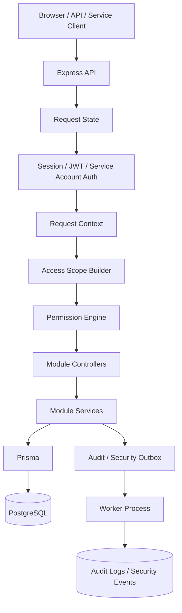

# Enterprise Backend Foundation Case Study

Language: [English](./README.md) | [Türkçe](./README.tr.md)

Public architecture and validation case study for a **private, active-development, production-oriented backend foundation**.

The private project explores how a multi-tenant ERP/internal-tools backend can be structured around authentication, authorization, tenant isolation, auditability, response minimization, validation, and deployment hardening.

This repository is **not** a runnable open-source starter template. It does not include the private source code, database schema, tests, secrets, or commercial product plans. It exists to document the architecture decisions, security model, validation strategy, tradeoffs, and lessons learned in a form that can be reviewed during portfolio screening or technical interviews.

## 30-Second Summary

| Area | Summary |
|---|---|
| Project type | Private-source backend foundation documented as a public case study |
| Status | Active development; production-oriented, not claimed as production-certified |
| Target use | Reusable backend foundation for ERP, internal tools, governance-heavy systems, and future domain modules |
| Main focus | Multi-tenancy, auth, authorization, tenant boundaries, auditability, validation, and deployment readiness |
| Public repo purpose | Architecture portfolio, technical discussion, and honest evidence trail |
| Public repo non-goal | Runnable framework, full source release, or claim of live enterprise production usage |

## What This Demonstrates

This case study is meant to show backend engineering judgment rather than a simple CRUD demo.

It focuses on problems that appear when a backend must support multiple tenants, sensitive data, privileged users, machine clients, audit history, and future modules:

- tenant isolation and tenant-scoped data access
- DB-backed browser sessions and explicit API/mobile token flows
- refresh-token rotation and reuse classification
- TOTP MFA and recovery-code safety
- service-account boundaries for machine clients
- centralized deny-by-default authorization
- RBAC, ABAC, ReBAC, and PBAC concepts
- response minimization and field projection
- durable audit/security outbox processing
- tamper-evident audit hash-chain design
- OpenAPI and route contract validation
- integration, security-abuse, concurrency, and performance smoke validation
- container and deployment-readiness considerations

## Architecture At A Glance

The important design idea is simple: business modules should not invent their own security rules. They should pass through shared authentication, tenant context, permission evaluation, validation, field projection, and audit paths.

## Engineering Evidence

| Concern | Case-study evidence |
|---|---|
| Tenant isolation | Tenant boundary is treated as a first-order security boundary before business permissions. |
| Authorization | Access decisions are centralized and designed to fail closed when required server-derived facts are missing. |
| Permission engine | The central decision point combines principal type, tenant boundary, route permission, scoped grants, relationship checks, tenant policies, session trust, and resource facts. |
| Auth/session safety | Browser-cookie flows, API token flows, refresh-token rotation, reuse handling, and MFA concurrency were reviewed as separate concerns. |
| Sensitive data exposure | Responses are designed around classification and projection instead of returning raw ORM objects. |
| Auditability | Audit logs and security events are separated, dispatched through an outbox, and designed with tamper-evident hash-chain verification. |
| Validation | The private repo recorded CI, fresh DB, integration, security-abuse, response-leak, concurrency, and platform checks. |
| Production honesty | The public docs explicitly state what is not proven yet: no external audit, no live customer usage, no public runnable source, and no production certification. |

## Case Study Documents

| Document | What it explains |
|---|---|
| [Architecture Overview](./docs/architecture-overview.md) | System layers, request pipeline, module contract, and why shared enforcement points matter. |
| [Security Model](./docs/security-model.md) | Security goals, protected assets, trust boundaries, major threats, and controls. |
| [Authorization Model](./docs/authorization-model.md) | RBAC/ABAC/ReBAC/PBAC, tenant boundary checks, scoped permissions, and service-account rules. |
| [Permission Engine Decision Flow](./docs/permission-engine-decision-flow.md) | Step-by-step explanation of the central authorization decision process. |
| [Audit and Integrity](./docs/audit-integrity.md) | Audit/security event separation, outbox processing, hash-chain design, and limits of tamper evidence. |
| [Data Classification](./docs/data-classification.md) | Response minimization, field projection, and safe handling of PII/confidential/security-sensitive fields. |
| [Testing and Validation](./docs/testing-and-validation.md) | Validation matrix, regression findings, local verification scope, and what the checks do not prove. |
| [Deployment Notes](./docs/deployment-notes.md) | Runtime shape, container hardening, CI/CD checks, environment validation, and operational gaps. |
| [Limitations](./docs/limitations.md) | Honest boundaries around private source, local validation, AI assistance, production usage, and future work. |
| [Lessons Learned](./docs/lessons-learned.md) | Practical lessons from architecture review, hardening, validation, and AI-assisted development. |
| [Portfolio Positioning](./docs/portfolio-positioning.md) | Suggested CV, LinkedIn, and interview framing for this private-source case study. |
| [Interview Walkthrough](./docs/interview-walkthrough.md) | A guided explanation path for technical interviews without exposing private code. |

## Representative Hardening Work

During review and validation of the private implementation, several realistic backend issues were identified and addressed in the private project:

- scoped authorization could fail open when resource dimension data was missing
- parallel refresh-token rotation needed concurrency-safe behavior
- MFA recovery codes needed atomic single-use enforcement
- cookie-based refresh responses needed to avoid returning token material in browser flows
- TOTP enrollment verification needed concurrency hardening
- password-reset webhook delivery needed timeout handling and signed payloads
- service accounts needed explicit boundaries for sensitive permissions
- route documentation needed manifest-style validation to reduce OpenAPI drift

The point is not that the prototype is perfect. The point is that the project was reviewed through failure modes that resemble real backend risk.

## Technology Stack

The private implementation used the following stack and concepts:

- TypeScript
- Node.js
- Express
- PostgreSQL
- Prisma
- Zod
- OpenAPI
- Docker
- Node test runner
- CI-style validation, integration tests, and security/concurrency checks

## How To Read This Repository

Read it as a **case-study folder**, not as a codebase.

A useful reading path is:

1. Start with this README.
2. Read [Architecture Overview](./docs/architecture-overview.md) to understand the system shape.
3. Read [Security Model](./docs/security-model.md), [Authorization Model](./docs/authorization-model.md), and [Permission Engine Decision Flow](./docs/permission-engine-decision-flow.md) to understand the main safety decisions.
4. Read [Testing and Validation](./docs/testing-and-validation.md) to see how claims were checked.
5. Read [Limitations](./docs/limitations.md) to understand what is not being claimed.
6. Use [Interview Walkthrough](./docs/interview-walkthrough.md) for a compact explanation path.

## Source Code Policy

The full private implementation is not published here because it may be reused as the basis for future commercial or domain-specific products.

This repository intentionally excludes:

- full source code
- private implementation details
- database schema files
- test files and raw logs
- deployment secrets
- customer data
- commercial product plans
- a runnable public starter template

Selected implementation details may be discussed in technical interviews when appropriate.

## AI-Assisted Development Disclosure

This was an AI-assisted engineering case study.

AI tools were used during generation, review, hardening, and documentation. My role was to define requirements, evaluate architecture, run validation commands, interpret results, identify edge cases, document decisions, and guide the hardening process.

The repository should be read as an honest architecture, validation, and learning case study, not as a claim that every implementation detail was manually authored from scratch.

## Status

This is a public portfolio case study for a private active-development backend foundation.

It is **production-oriented** in its design goals, but it is **not presented as a production-certified, externally audited, live enterprise product**.
