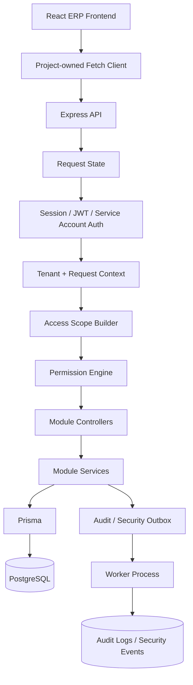

# Enterprise ERP / SaaS Platform Case Study

Language: [English](./README.md) | [Türkçe](./README.tr.md)

Public architecture, validation, and engineering case study for a **private-source, active-development, full-stack ERP/SaaS platform**.

> Repository naming note: this public repository originally documented the backend foundation only, so its repository name and many of its deep-dive documents remain backend-focused. The underlying private project has since expanded into an active full-stack application. This case study now documents that evolution without pretending that the public repository contains the runnable product.

The private project combines a production-oriented multi-tenant backend foundation with an operational React frontend. The backend focuses on authentication, authorization, tenant isolation, auditability, response minimization, validation, resilience, and deployment hardening. The frontend is being built as a separate workspace around real ERP workflows, permission-aware navigation, server-state management, localization, accessible interaction primitives, and browser-safe API integration.

This repository is **not a runnable open-source application or starter template**. It intentionally does not include the private application source, database schema, tests, secrets, or commercial product plans. Its purpose is to provide an honest, reviewable record of architecture decisions, implemented engineering patterns, validation strategy, tradeoffs, limitations, and lessons learned for portfolio screening and technical interviews.

## 30-Second Summary

| Area | Summary |
|---|---|
| Project type | Private-source, full-stack multi-tenant ERP/SaaS platform documented through a public case study |
| Status | Active development; production-oriented engineering goals, not production-certified |
| Frontend | React + TypeScript + Vite with TanStack Router/Query, Radix Primitives, i18n, design-token CSS, and a project-owned Fetch client |
| Backend | Node.js + TypeScript + Express + Prisma + PostgreSQL with strong tenancy, auth, authorization, audit, validation, and deployment controls |
| Current product direction | Reusable internal ERP foundation plus shared frontend foundations for future vertical/domain products |
| Public repo purpose | Architecture portfolio, technical discussion, implementation evidence summary, and honest limitations |
| Public repo non-goal | Runnable source release, complete commercial ERP, production certification, or claim of live customer usage |

## What This Demonstrates

This case study is intended to show more than a CRUD demo or a collection of screens. It documents decisions that appear when a real business application must connect browser UX, API contracts, identity, permissions, tenant context, domain workflows, sensitive data, audit history, and deployment constraints.

### Full-stack application work

The active private project includes:

- a separate `frontend/` workspace built with Vite, React, and TypeScript
- TanStack Router for application routing and route-level loading boundaries
- TanStack Query for server-state queries, mutations, scoped query keys, and cache invalidation
- Radix Primitives for accessible dialogs, tabs, selects, menus, and similar behavior-heavy surfaces
- i18next/react-i18next for user-facing system text
- design-token-driven styling rather than a heavy visual component platform
- a small project-owned Fetch API wrapper with credentialed requests, CSRF handling, and normalized API errors
- permission-aware ERP navigation and route shaping
- real browser login/session/cookie/CSRF/bootstrap integration smoke paths
- feature surfaces for business partners, customer accounts, catalog, sales, dashboard, preferences/settings, and administrative foundations

The frontend remains under active development. Some flows are API-backed, while other surfaces are still adapter-backed, deferred, or being hardened before broader product completion. The public case study intentionally distinguishes what exists today from what is only planned.

### Backend engineering work

The backend foundation focuses on problems that become important in multi-tenant enterprise systems:

- tenant isolation and tenant-scoped data access
- DB-backed browser sessions and explicit API/mobile token flows
- refresh-token rotation and reuse classification
- TOTP MFA and recovery-code safety
- service-account boundaries for machine clients
- centralized deny-by-default authorization
- RBAC, ABAC, ReBAC, and PBAC concepts
- response minimization and field projection
- durable audit/security outbox processing
- tamper-evident audit hash-chain design
- OpenAPI and route-contract validation
- integration, security-abuse, concurrency, and performance smoke validation
- container and deployment-readiness considerations

## Architecture At A Glance

```mermaid
flowchart TD
    Browser[React ERP Frontend] --> Client[Project-owned Fetch Client]
    Client --> API[Express API]
    API --> State[Request State]
    State --> Auth[Session / JWT / Service Account Auth]
    Auth --> Context[Tenant + Request Context]
    Context --> Scope[Access Scope Builder]
    Scope --> Permission[Permission Engine]
    Permission --> Controller[Module Controllers]
    Controller --> Service[Module Services]
    Service --> Prisma[Prisma]
    Prisma --> DB[(PostgreSQL)]
    Service --> Outbox[Audit / Security Outbox]
    Outbox --> Worker[Worker Process]
    Worker --> Audit[(Audit Logs / Security Events)]
```

The important idea is that frontend convenience does not replace backend authority. The browser can shape UX based on permissions and capabilities, but tenant boundaries, authorization, sensitive-field decisions, lifecycle rules, and authoritative validation remain server-owned.

## Current Frontend Evidence

The private repository currently contains a real frontend workspace rather than only a design plan. Representative implementation evidence includes:

- React application bootstrap and provider composition
- TanStack Router route tree with lazy-loaded ERP pages
- TanStack Query query/mutation hooks and scoped cache invalidation
- Business Partners list/detail/create flows using accessible Radix dialogs
- localized UI text through `react-i18next`
- a credentialed Fetch wrapper that handles CSRF and normalized API errors
- browser session setup and API-backed bootstrap smoke flow
- separate feature, domain, shared, app, i18n, and style boundaries

The selected frontend architecture also includes OpenAPI-derived TypeScript types and local Zod-based UX validation where useful. Those are architectural targets and should not be read as a claim that every planned frontend foundation item is already complete.

For details, read [Frontend Architecture and Integration](./docs/frontend-architecture-and-integration.md).

## Backend Engineering Evidence

| Concern | Case-study evidence |
|---|---|
| Tenant isolation | Tenant boundary is treated as a first-order security boundary before business permissions. |
| Authorization | Access decisions are centralized and designed to fail closed when required server-derived facts are missing. |
| Permission engine | The central decision point combines principal type, tenant boundary, route permission, scoped grants, relationship checks, tenant policies, session trust, and resource facts. |
| Auth/session safety | Browser-cookie flows, API token flows, refresh-token rotation, reuse handling, and MFA concurrency are treated as separate concerns. |
| Sensitive data exposure | Responses are designed around classification and projection instead of returning raw ORM objects. |
| Auditability | Audit logs and security events are separated, dispatched through an outbox, and designed with tamper-evident hash-chain verification. |
| Validation | The private repository records CI, fresh-database, integration, security-abuse, response-leak, concurrency, and platform checks. |
| Production honesty | The public docs explicitly state what is not proven: no external audit, no live customer usage, no public runnable source, and no production certification. |

## Case Study Documents

| Document | What it explains |
|---|---|
| [Frontend Architecture and Integration](./docs/frontend-architecture-and-integration.md) | Current frontend stack, implemented application boundaries, API integration, and the difference between implemented and planned frontend work. |
| [Backend Architecture Overview](./docs/architecture-overview.md) | Backend layers, request pipeline, module contract, and why shared enforcement points matter. |
| [Security Model](./docs/security-model.md) | Security goals, protected assets, trust boundaries, major threats, and controls. |
| [Authorization Model](./docs/authorization-model.md) | RBAC/ABAC/ReBAC/PBAC, tenant boundary checks, scoped permissions, and service-account rules. |
| [Permission Engine Decision Flow](./docs/permission-engine-decision-flow.md) | Step-by-step explanation of the central authorization decision process. |
| [Audit and Integrity](./docs/audit-integrity.md) | Audit/security event separation, outbox processing, hash-chain design, and limits of tamper evidence. |
| [Data Classification](./docs/data-classification.md) | Response minimization, field projection, and safe handling of PII/confidential/security-sensitive fields. |
| [Testing and Validation](./docs/testing-and-validation.md) | Validation matrix, regression findings, private validation scope, and what the checks do not prove. |
| [Deployment Notes](./docs/deployment-notes.md) | Runtime shape, container hardening, CI/CD checks, environment validation, and operational gaps. |
| [Limitations](./docs/limitations.md) | Honest boundaries around private source, frontend maturity, validation, AI assistance, and production usage. |
| [Lessons Learned](./docs/lessons-learned.md) | Practical lessons from architecture review, hardening, validation, and AI-assisted development. |
| [Portfolio Positioning](./docs/portfolio-positioning.md) | Suggested CV, LinkedIn, GitHub, and interview framing for the evolving full-stack project. |
| [Interview Walkthrough](./docs/interview-walkthrough.md) | A guided explanation path for technical interviews without exposing private code. |

## Technology Stack

### Frontend — current implementation

- React
- TypeScript
- Vite
- TanStack Router
- TanStack Query
- Radix Primitives
- i18next / react-i18next
- Fetch API through a small project-owned client
- design-token CSS
- Lucide icons

### Backend

- TypeScript
- Node.js
- Express
- PostgreSQL
- Prisma
- Zod
- OpenAPI
- Docker
- Node test runner
- CI-style validation, integration tests, and security/concurrency checks

## How To Read This Repository

Read this repository as a **case-study and engineering-evidence folder**, not as the application codebase.

A useful path is:

1. Start with this README for current project scope.
2. Read [Frontend Architecture and Integration](./docs/frontend-architecture-and-integration.md) for the full-stack evolution and current frontend evidence.
3. Read [Backend Architecture Overview](./docs/architecture-overview.md) for the backend foundation.
4. Read [Security Model](./docs/security-model.md), [Authorization Model](./docs/authorization-model.md), and [Permission Engine Decision Flow](./docs/permission-engine-decision-flow.md) for the main security decisions.
5. Read [Testing and Validation](./docs/testing-and-validation.md) to understand how claims were checked.
6. Read [Limitations](./docs/limitations.md) to understand what is not being claimed.
7. Use [Interview Walkthrough](./docs/interview-walkthrough.md) for a compact explanation path.

## Source Code Policy

The full private implementation is not published here because it may be reused as the basis for future commercial or domain-specific products.

This repository intentionally excludes:

- full backend and frontend source code
- private implementation details
- database schema files
- test files and raw logs
- deployment secrets
- customer data
- commercial product plans
- a runnable public starter application

Selected implementation details may be discussed in technical interviews when appropriate.

## AI-Assisted Development Disclosure

This is an AI-assisted engineering case study.

AI tools have been used during generation, review, hardening, implementation support, and documentation. My role has included defining requirements, evaluating architecture, running validation commands, interpreting results, identifying edge cases, reviewing implementation behavior, documenting decisions, and directing the hardening process.

The repository should be read as an honest record of engineering judgment, validation, iterative development, and learning—not as a claim that every implementation detail was manually authored from scratch.

## Status

The underlying private project is an **active-development full-stack ERP/SaaS platform** built on a mature backend foundation and an evolving operational frontend.

It is **production-oriented in engineering goals**, but it is **not presented as production-certified, externally audited, fully complete, or live with enterprise customers**.
