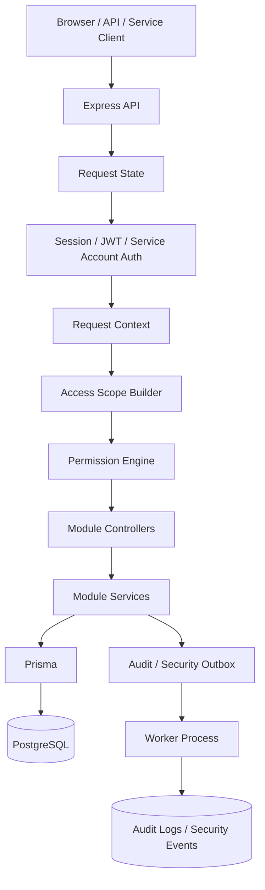

# Enterprise Backend Foundation Case Study

Dil: [English](./README.md) | [Türkçe](./README.tr.md)

**Private tutulan, aktif geliştirme aşamasındaki ve production seviyesine hazırlanacak şekilde tasarlanan bir backend altyapısı** için public mimari ve doğrulama case study'si.

Private proje; çok kiracılı ERP/iç araçlar backend'inin kimlik doğrulama, yetkilendirme, tenant izolasyonu, auditability, response minimization, validation ve deployment hardening etrafında nasıl yapılandırılabileceğini araştırır.

Bu repository **çalıştırılabilir bir open-source starter template değildir**. Private kaynak kodu, veritabanı şeması, testler, secret'lar veya ticari ürün planları burada yer almaz. Bu repo; mimari kararları, güvenlik modelini, validation stratejisini, tradeoff'ları ve öğrenilen dersleri portfolio taraması veya teknik mülakatlarda incelenebilecek şekilde belgelemek için vardır.

## 30 Saniyelik Özet

| Alan | Özet |
|---|---|
| Proje tipi | Private-source backend foundation için public case study |
| Durum | Aktif geliştirme; production-oriented, ancak production-certified iddiası yok |
| Hedef kullanım | ERP, iç araçlar, governance-heavy sistemler ve gelecekteki domain modülleri için reusable backend foundation |
| Ana odak | Multi-tenancy, auth, authorization, tenant boundaries, auditability, validation ve deployment readiness |
| Public repo amacı | Mimari portfolio, teknik tartışma ve dürüst kanıt izi |
| Public repo olmayan şey | Runnable framework, full source release veya canlı enterprise production usage iddiası |

## Bu Case Study Neyi Gösteriyor?

Bu case study basit bir CRUD demosundan çok, backend engineering judgment göstermeyi amaçlar.

Bir backend'in birden fazla tenant, hassas veri, yetkili kullanıcılar, machine client'lar, audit history ve gelecekteki modülleri desteklemesi gerektiğinde ortaya çıkan problemleri ele alır:

- tenant isolation ve tenant-scoped data access
- DB-backed browser sessions ve explicit API/mobile token flows
- refresh-token rotation ve reuse classification
- TOTP MFA ve recovery-code safety
- machine client'lar için service-account boundaries
- centralized deny-by-default authorization
- RBAC, ABAC, ReBAC ve PBAC konseptleri
- response minimization ve field projection
- durable audit/security outbox processing
- tamper-evident audit hash-chain design
- OpenAPI ve route contract validation
- integration, abuse-case, concurrency ve performance smoke validation
- container ve deployment-readiness considerations

## Mimariye Hızlı Bakış

Temel fikir basit: business module'lar kendi güvenlik kurallarını uydurmamalı. Hepsi aynı authentication, tenant context, permission evaluation, validation, field projection ve audit yollarından geçmeli.

## Engineering Evidence

| Konu | Case-study kanıtı |
|---|---|
| Tenant isolation | Tenant boundary, business permission'lardan önce gelen bir güvenlik sınırı olarak ele alınır. |
| Authorization | Access decision'lar merkezi yapılır ve gerekli server-derived fact'ler eksikse fail closed davranacak şekilde tasarlanır. |
| Permission engine | Principal type, tenant boundary, route permission, scoped grants, relationship checks, tenant policies, session trust ve resource facts tek karar noktasında birleşir. |
| Auth/session safety | Browser-cookie flows, API token flows, refresh-token rotation, reuse handling ve MFA concurrency ayrı riskler olarak ele alınır. |
| Sensitive data exposure | Response'lar raw ORM object döndürmek yerine classification ve projection etrafında tasarlanır. |
| Auditability | Audit logs ve security events ayrılır, outbox üzerinden dispatch edilir ve tamper-evident hash-chain doğrulamasıyla desteklenir. |
| Validation | Private repo CI, fresh DB, integration, abuse-case, response-leak, concurrency ve platform checks kayıtlarını içerir. |
| Production honesty | Public dokümanlar neyin kanıtlanmadığını açıkça söyler: external audit yok, live customer usage yok, public runnable source yok, production certification yok. |

## Case Study Dokümanları

| Doküman | Ne anlatır? |
|---|---|
| [Architecture Overview](./docs/tr/architecture-overview.md) | Sistem layer'ları, request pipeline, module contract ve shared enforcement noktalarının neden önemli olduğu. |
| [Security Model](./docs/tr/security-model.md) | Güvenlik hedefleri, korunan varlıklar, trust boundary'ler, ana riskler ve kontroller. |
| [Authorization Model](./docs/tr/authorization-model.md) | RBAC/ABAC/ReBAC/PBAC, tenant boundary checks, scoped permissions ve service-account rules. |
| [Permission Engine Decision Flow](./docs/tr/permission-engine-decision-flow.md) | Merkezi authorization decision sürecinin adım adım açıklaması. |
| [Audit and Integrity](./docs/tr/audit-integrity.md) | Audit/security event ayrımı, outbox processing, hash-chain design ve tamper evidence sınırları. |
| [Data Classification](./docs/tr/data-classification.md) | Response minimization, field projection ve PII/confidential/security-sensitive alanların güvenli ele alınması. |
| [Testing and Validation](./docs/tr/testing-and-validation.md) | Validation matrix, regression findings, private/local verification kapsamı ve bu kontrollerin neyi kanıtlamadığı. |
| [Deployment Notes](./docs/tr/deployment-notes.md) | Runtime shape, container hardening, CI/CD checks, environment validation ve operational gaps. |
| [Limitations](./docs/tr/limitations.md) | Private source, local validation, AI assistance, production usage ve future work konularında dürüst sınırlar. |
| [Lessons Learned](./docs/tr/lessons-learned.md) | Architecture review, hardening, validation ve AI-assisted development sürecinden öğrenilen pratik dersler. |
| [Portfolio Positioning](./docs/tr/portfolio-positioning.md) | CV, LinkedIn ve mülakatlarda bu private-source case study'nin nasıl sunulacağı. |
| [Interview Walkthrough](./docs/tr/interview-walkthrough.md) | Private kodu açmadan teknik mülakatta projeyi anlatmak için rehber. |

İngilizce dokümanlar için [README.md](./README.md) dosyasındaki doküman listesine bakabilirsin.

## Representative Hardening Work

Private implementation review ve validation sırasında gerçekçi backend risklerine benzeyen bazı konular ele alındı:

- scoped authorization, resource dimension data eksikken fail open davranabilirdi
- parallel refresh-token rotation concurrency-safe hale getirilmeliydi
- MFA recovery code kullanımında atomic single-use enforcement gerekiyordu
- browser refresh response'ları token material döndürmemeliydi
- TOTP enrollment verification concurrency hardening gerektiriyordu
- password-reset webhook delivery timeout ve signed payload gerektiriyordu
- service account'lar sensitive permissions için explicit boundaries gerektiriyordu
- route documentation, OpenAPI drift'i azaltmak için manifest-style validation gerektiriyordu

Amaç “prototype kusursuzdur” demek değildir. Amaç, projenin gerçek backend risklerine benzeyen failure mode'lar üzerinden incelendiğini göstermektir.

## Technology Stack

Private implementation şu stack ve konseptleri kullandı:

- TypeScript
- Node.js
- Express
- PostgreSQL
- Prisma
- Zod
- OpenAPI
- Docker
- Node test runner
- CI-style validation, integration tests ve security/concurrency checks

## Bu Repository Nasıl Okunmalı?

Bu repoyu bir **case-study klasörü** gibi oku, bir codebase gibi değil.

Önerilen okuma sırası:

1. Bu README ile başla.
2. Sistem şeklini anlamak için [Architecture Overview](./docs/tr/architecture-overview.md) dosyasını oku.
3. Ana güvenlik kararlarını anlamak için [Security Model](./docs/tr/security-model.md), [Authorization Model](./docs/tr/authorization-model.md) ve [Permission Engine Decision Flow](./docs/tr/permission-engine-decision-flow.md) dosyalarını oku.
4. İddiaların nasıl kontrol edildiğini görmek için [Testing and Validation](./docs/tr/testing-and-validation.md) dosyasını oku.
5. Neyin iddia edilmediğini anlamak için [Limitations](./docs/tr/limitations.md) dosyasını oku.
6. Kısa mülakat anlatımı için [Interview Walkthrough](./docs/tr/interview-walkthrough.md) dosyasını kullan.

## Source Code Policy

Full private implementation burada yayınlanmamıştır; çünkü gelecekte ticari veya domain-specific ürünlere temel olarak yeniden kullanılabilir.

Bu repository bilinçli olarak şunları içermez:

- full source code
- private implementation details
- database schema files
- test files ve raw logs
- deployment secrets
- customer data
- commercial product plans
- runnable public starter template

Uygun teknik mülakatlarda seçili implementation detayları konuşulabilir.

## AI-Assisted Development Disclosure

Bu bir AI-assisted engineering case study'dir.

AI araçları generation, review, hardening ve documentation aşamalarında kullanıldı. Benim rolüm requirement'ları belirlemek, architecture değerlendirmek, validation command'larını çalıştırmak, sonuçları yorumlamak, edge case'leri bulmak, kararları belgelemek ve hardening sürecini yönlendirmekti.

Repository; her implementation detayının sıfırdan manuel yazıldığı iddiası değil, dürüst bir architecture, validation ve learning case study olarak okunmalıdır.

## Status

Bu, private active-development backend foundation için public portfolio case study'dir.

Tasarım hedefleri açısından **production-oriented**'dır; ancak **production-certified, externally audited veya live enterprise product** olarak sunulmamaktadır.
