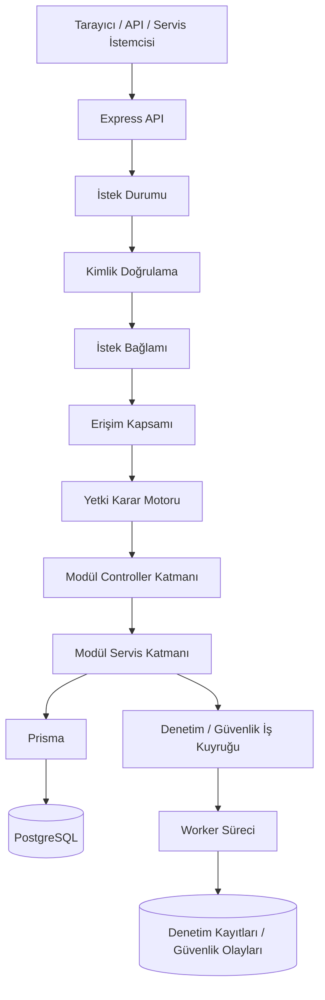

# Enterprise Backend Foundation Case Study

Dil: [English](./README.md) | [Türkçe](./README.tr.md)

**Özel kaynak kodlu (private-source), aktif geliştirme aşamasındaki ve üretim ortamına hazırlık hedefiyle (production-oriented) tasarlanan bir backend altyapı temeli (backend foundation)** için herkese açık mimari ve doğrulama çalışmasıdır.

Özel depoda tutulan proje; çok kiracılı (multi-tenant) ERP ve iç araçlar backend'inin kimlik doğrulama (authentication), yetkilendirme (authorization), kiracı yalıtımı (tenant isolation), denetlenebilirlik (auditability), yanıt sadeleştirme (response minimization), doğrulama (validation) ve dağıtım hazırlığı (deployment readiness) etrafında nasıl yapılandırılabileceğini inceler.

Bu repository **çalıştırılabilir bir açık kaynak başlangıç şablonu (runnable open-source starter template) değildir**. Özel kaynak kod, veritabanı şeması, testler, gizli yapılandırmalar veya ticari ürün planları burada yer almaz. Bu repo; mimari kararları, güvenlik modelini, doğrulama stratejisini, tasarım ödünlerini (trade-offs) ve öğrenilen dersleri portfolyo incelemesi veya teknik görüşmelerde değerlendirilebilecek şekilde belgelemek için vardır.

Türkçe dokümanlarda kullanılan terim standardı için: [Terimler ve Yazım Standardı](./docs/tr/terimler.md)

## 30 Saniyelik Özet

| Alan | Özet |
|---|---|
| Proje tipi | Özel kaynak kodlu backend altyapı temeli için herkese açık case study |
| Durum | Aktif geliştirme; üretim ortamına hazırlık hedefli, ancak üretim sertifikası iddiası yok |
| Hedef kullanım | ERP, iç araçlar, yönetişim ağırlıklı sistemler ve gelecekteki iş modülleri için yeniden kullanılabilir backend altyapısı |
| Ana odak | Çok kiracılı yapı, kimlik doğrulama, yetkilendirme, kiracı sınırları, denetlenebilirlik, doğrulama ve dağıtım hazırlığı |
| Public repo amacı | Mimari portfolyo, teknik tartışma ve dürüst kanıt izi |
| Public repo olmayan şey | Çalıştırılabilir framework, tam kaynak kod yayını veya canlı kurumsal üretim kullanımı iddiası |

## Bu Çalışma Neyi Gösteriyor?

Bu çalışma basit bir CRUD demosundan çok, backend mühendisliği karar verme becerisini göstermeyi amaçlar.

Bir backend'in birden fazla kiracıyı, hassas veriyi, yetkili kullanıcıları, servis hesaplarını, denetim geçmişini ve gelecekteki modülleri desteklemesi gerektiğinde ortaya çıkan problemleri ele alır:

- kiracı yalıtımı ve kiracı kapsamlı veri erişimi
- veritabanı destekli tarayıcı oturumları ve açık API/mobil erişim akışları
- servis hesapları için güvenli sınırlar
- merkezi ve varsayılan olarak reddeden yetkilendirme
- RBAC, ABAC, ReBAC ve PBAC erişim kontrolü yaklaşımları
- yanıt sadeleştirme ve alan filtreleme
- dayanıklı denetim/güvenlik iş kuyruğu
- kurcalamayı belli eden denetim kayıt zinciri
- OpenAPI ve rota sözleşmesi doğrulaması
- entegrasyon, kötüye kullanım senaryosu, eşzamanlılık ve performans duman testi doğrulamaları
- konteyner ve dağıtım hazırlığı konuları

## Mimariye Hızlı Bakış

Temel fikir basit: iş modülleri kendi güvenlik kurallarını uydurmamalıdır. Hepsi aynı kimlik doğrulama, kiracı bağlamı, yetki değerlendirmesi, doğrulama, alan filtreleme ve denetim yollarından geçmelidir.

## Mühendislik Kanıtı

| Konu | Case-study kanıtı |
|---|---|
| Kiracı yalıtımı | Kiracı sınırı, iş izinlerinden önce gelen bir güvenlik sınırı olarak ele alınır. |
| Yetkilendirme | Erişim kararları merkezi verilir ve gerekli sunucu tarafından doğrulanan bilgiler eksikse güvenli biçimde reddeder. |
| Yetki karar motoru | Aktör tipi, kiracı sınırı, rota izni, kapsam kısıtları, ilişki kontrolleri, kiracı politikaları, oturum güven düzeyi ve kaynak bilgileri tek karar noktasında birleşir. |
| Hassas veri görünürlüğü | Yanıtlar ham ORM nesnesi döndürmek yerine sınıflandırma ve alan filtreleme etrafında tasarlanır. |
| Denetlenebilirlik | Denetim kayıtları ve güvenlik olayları ayrılır, iş kuyruğu üzerinden işlenir ve kurcalamayı belli eden kayıt zinciri ile desteklenir. |
| Doğrulama | Özel repo; CI, temiz veritabanı, entegrasyon, kötüye kullanım senaryosu, yanıt sızıntısı, eşzamanlılık ve platform kontrolleri kayıtlarını içerir. |
| Dürüst üretim durumu | Public dokümanlar neyin kanıtlanmadığını açıkça söyler: dış denetim yok, canlı müşteri kullanımı yok, public çalıştırılabilir kaynak yok, üretim sertifikası yok. |

## Case Study Dokümanları

| Doküman | Ne anlatır? |
|---|---|
| [Terimler ve Yazım Standardı](./docs/tr/terimler.md) | Türkçe dokümanlarda teknik terimlerin nasıl kullanılacağı. |
| [Mimari Genel Bakış](./docs/tr/architecture-overview.md) | Sistem katmanları, istek akışı, modül sözleşmesi ve ortak güvenlik noktalarının neden önemli olduğu. |
| [Güvenlik Modeli](./docs/tr/security-model.md) | Güvenlik hedefleri, korunan varlıklar, güven sınırları, ana riskler ve kontroller. |
| [Yetkilendirme Modeli](./docs/tr/authorization-model.md) | RBAC/ABAC/ReBAC/PBAC, kiracı sınırı kontrolleri, kapsamlı yetkiler ve servis hesabı kuralları. |
| [Yetki Karar Motoru Akışı](./docs/tr/permission-engine-decision-flow.md) | Merkezi yetkilendirme karar sürecinin adım adım açıklaması. |
| [Denetim ve Bütünlük](./docs/tr/audit-integrity.md) | Denetim/güvenlik olayı ayrımı, iş kuyruğu, kayıt zinciri tasarımı ve kurcalama tespiti sınırları. |
| [Veri Sınıflandırma](./docs/tr/data-classification.md) | Yanıt sadeleştirme, alan filtreleme ve kişisel/gizli/güvenliğe duyarlı alanların güvenli ele alınması. |
| [Test ve Doğrulama](./docs/tr/testing-and-validation.md) | Doğrulama matrisi, regresyon bulguları, private/local doğrulama kapsamı ve bu kontrollerin neyi kanıtlamadığı. |
| [Dağıtım Notları](./docs/tr/deployment-notes.md) | Çalışma zamanı yapısı, konteyner sertleştirme, CI/CD kontrolleri, ortam doğrulama ve operasyonel boşluklar. |
| [Sınırlar](./docs/tr/limitations.md) | Özel kaynak kod, yerel doğrulama, AI desteği, üretim kullanımı ve gelecek çalışma konularında dürüst sınırlar. |
| [Öğrenilen Dersler](./docs/tr/lessons-learned.md) | Mimari inceleme, sertleştirme, doğrulama ve AI destekli geliştirme sürecinden öğrenilen pratik dersler. |
| [Portfolyo Konumlandırma](./docs/tr/portfolio-positioning.md) | CV, LinkedIn ve görüşmelerde bu çalışmanın nasıl sunulacağı. |
| [Görüşme Anlatım Rehberi](./docs/tr/interview-walkthrough.md) | Private kodu açmadan teknik görüşmede projeyi anlatmak için rehber. |

## Bu Repository Nasıl Okunmalı?

Bu repoyu bir **case-study klasörü** gibi oku, bir codebase gibi değil.

Önerilen okuma sırası:

1. Bu README ile başla.
2. Terim standardı için [Terimler ve Yazım Standardı](./docs/tr/terimler.md) dosyasına bak.
3. Sistem şeklini anlamak için [Mimari Genel Bakış](./docs/tr/architecture-overview.md) dosyasını oku.
4. Ana güvenlik kararlarını anlamak için [Güvenlik Modeli](./docs/tr/security-model.md), [Yetkilendirme Modeli](./docs/tr/authorization-model.md) ve [Yetki Karar Motoru Akışı](./docs/tr/permission-engine-decision-flow.md) dosyalarını oku.
5. İddiaların nasıl kontrol edildiğini görmek için [Test ve Doğrulama](./docs/tr/testing-and-validation.md) dosyasını oku.
6. Neyin iddia edilmediğini anlamak için [Sınırlar](./docs/tr/limitations.md) dosyasını oku.
7. Kısa görüşme anlatımı için [Görüşme Anlatım Rehberi](./docs/tr/interview-walkthrough.md) dosyasını kullan.

## Kaynak Kod Politikası

Tam özel uygulama burada yayınlanmamıştır; çünkü gelecekte ticari veya alan odaklı ürünlere temel olarak yeniden kullanılabilir.

Bu repository bilinçli olarak tam kaynak kod, özel uygulama detayları, veritabanı şemaları, test dosyaları, ham loglar, gizli yapılandırmalar, müşteri verisi, ticari ürün planları veya çalıştırılabilir public başlangıç şablonu içermez.

## AI Destekli Geliştirme Açıklaması

Bu bir AI destekli mühendislik case study'sidir.

AI araçları üretim, inceleme, sertleştirme ve dokümantasyon aşamalarında kullanıldı. Benim rolüm gereksinimleri belirlemek, mimariyi değerlendirmek, doğrulama komutlarını çalıştırmak, sonuçları yorumlamak, uç durumları bulmak, kararları belgelemek ve sertleştirme sürecini yönlendirmekti.

Repository; her uygulama detayının sıfırdan manuel yazıldığı iddiası değil, dürüst bir mimari, doğrulama ve öğrenme çalışması olarak okunmalıdır.

## Durum

Bu, özel kaynak kodlu ve aktif geliştirme aşamasındaki backend altyapı temeli için public portfolyo çalışmasıdır.

Tasarım hedefleri açısından **üretim ortamına hazırlık hedeflidir (production-oriented)**; ancak **üretim sertifikalı, dış denetimden geçmiş veya canlı kurumsal ürün** olarak sunulmamaktadır.
