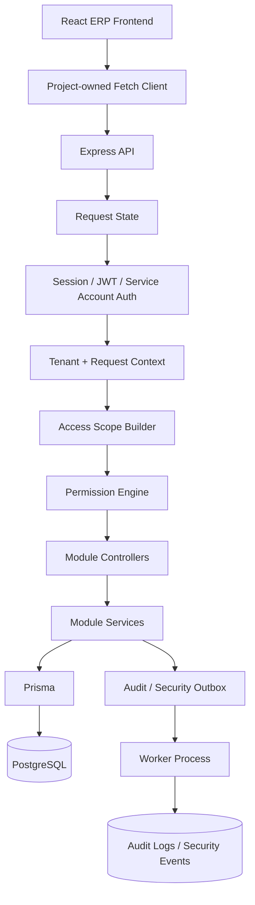

# Enterprise ERP / SaaS Platform Case Study

Dil: [English](./README.md) | [Türkçe](./README.tr.md)

**Özel kaynak kodlu (private-source), aktif geliştirme aşamasındaki, full-stack ERP/SaaS platformu** için herkese açık mimari, doğrulama ve mühendislik case study'sidir.

> Repository adıyla ilgili not: Bu public repository ilk oluşturulduğunda yalnızca backend foundation'ı belgeliyordu. Bu nedenle repository adı ve derinlemesine dokümanların önemli bir bölümü hâlâ backend odaklıdır. Alttaki private proje daha sonra aktif bir full-stack uygulamaya genişledi. Bu case study artık bu gelişimi de belgeliyor; ancak public repository'nin çalıştırılabilir ürün kaynak kodunu içerdiği iddia edilmiyor.

Private proje, üretim ortamına hazırlık hedefiyle tasarlanan çok kiracılı backend foundation ile operasyonel React frontend'i bir araya getirir. Backend; authentication, authorization, tenant isolation, auditability, response minimization, validation, dayanıklılık ve deployment hardening konularına odaklanır. Frontend ise ayrı bir workspace içinde gerçek ERP akışları, permission-aware navigation, server-state management, localization, erişilebilir etkileşim bileşenleri ve browser-safe API integration etrafında geliştirilmektedir.

Bu repository **çalıştırılabilir açık kaynak uygulama veya starter template değildir**. Private uygulama kaynak kodunu, veritabanı şemasını, testleri, secret'ları veya ticari ürün planlarını bilinçli olarak içermez. Amaç; mimari kararları, gerçek uygulama örüntülerini, doğrulama stratejisini, trade-off'ları, sınırları ve öğrenilen dersleri portfolyo incelemesi ve teknik görüşmeler için dürüst biçimde belgelemektir.

Türkçe dokümanlarda kullanılan terim standardı için: [Terimler ve Yazım Standardı](./docs/tr/terimler.md)

## 30 Saniyelik Özet

| Alan | Özet |
|---|---|
| Proje tipi | Private-source, full-stack multi-tenant ERP/SaaS platformu için public case study |
| Durum | Aktif geliştirme; production-oriented mühendislik hedefleri var, production certification iddiası yok |
| Frontend | React + TypeScript + Vite; TanStack Router/Query, Radix Primitives, i18n, design-token CSS ve project-owned Fetch client |
| Backend | Node.js + TypeScript + Express + Prisma + PostgreSQL; tenancy, auth, authorization, audit, validation ve deployment kontrolleri |
| Güncel ürün yönü | Yeniden kullanılabilir internal ERP foundation ve gelecekteki vertical/domain ürünler için ortak frontend foundation |
| Public repo amacı | Mimari portfolyo, teknik tartışma, implementation evidence özeti ve dürüst sınırlar |
| Public repo olmayan şey | Runnable source release, tamamlanmış ticari ERP, production certification veya canlı müşteri kullanımı iddiası |

## Bu Çalışma Neyi Gösteriyor?

Bu case study basit bir CRUD demosu veya ekran koleksiyonundan fazlasını göstermeyi amaçlar. Gerçek bir iş uygulamasında browser UX, API contracts, identity, permissions, tenant context, domain workflows, sensitive data, audit history ve deployment constraints bir araya geldiğinde alınması gereken mühendislik kararlarını belgeler.

### Full-stack uygulama çalışması

Aktif private proje şu alanları içerir:

- Vite, React ve TypeScript ile ayrı `frontend/` workspace
- uygulama routing'i ve route-level loading sınırları için TanStack Router
- server-state query/mutation, scoped query keys ve cache invalidation için TanStack Query
- dialog, tab, select, menu gibi davranış ağırlıklı erişilebilir yüzeyler için Radix Primitives
- kullanıcıya gösterilen sistem metinleri için i18next/react-i18next
- ağır görsel component platform yerine design-token-driven styling
- credentialed request, CSRF handling ve normalize API error davranışları olan küçük project-owned Fetch API wrapper
- permission-aware ERP navigation ve route shaping
- gerçek browser login/session/cookie/CSRF/bootstrap integration smoke akışları
- Business Partners, Customer Accounts, Catalog, Sales, Dashboard, Preferences/Settings ve admin foundation yüzeyleri

Frontend aktif geliştirme aşamasındadır. Bazı akışlar gerçek API ile bağlıyken bazı yüzeyler hâlâ adapter-backed, deferred veya daha geniş ürün tamamlanmadan önce hardening aşamasındadır. Public case study, bugün gerçekten var olanlarla yalnızca planlananları özellikle ayırır.

### Backend mühendislik çalışması

Backend foundation, multi-tenant enterprise sistemlerde önemli hale gelen şu konulara odaklanır:

- tenant isolation ve tenant-scoped data access
- DB-backed browser session ve ayrı API/mobile token akışları
- refresh-token rotation ve reuse classification
- TOTP MFA ve recovery-code safety
- machine client'lar için service-account boundaries
- merkezi deny-by-default authorization
- RBAC, ABAC, ReBAC ve PBAC yaklaşımları
- response minimization ve field projection
- durable audit/security outbox processing
- tamper-evident audit hash-chain design
- OpenAPI ve route-contract validation
- integration, security-abuse, concurrency ve performance smoke validation
- container ve deployment-readiness konuları

## Mimariye Hızlı Bakış

```mermaid
flowchart TD
    Browser[React ERP Frontend] --> Client[Project-owned Fetch Client]
    Client --> API[Express API]
    API --> State[Request State]
    State --> Auth[Session / JWT / Service Account Auth]
    Auth --> Context[Tenant + Request Context]
    Context --> Scope[Access Scope Builder]
    Scope --> Permission[Permission Engine]
    Permission --> Controller[Module Controllers]
    Controller --> Service[Module Services]
    Service --> Prisma[Prisma]
    Prisma --> DB[(PostgreSQL)]
    Service --> Outbox[Audit / Security Outbox]
    Outbox --> Worker[Worker Process]
    Worker --> Audit[(Audit Logs / Security Events)]
```

Temel fikir: frontend kolaylığı backend otoritesinin yerini almaz. Browser permissions/capabilities bilgisine göre UX'i şekillendirebilir; fakat tenant boundaries, authorization, sensitive-field decisions, lifecycle rules ve authoritative validation sunucu tarafında kalır.

## Güncel Frontend Kanıtı

Private repository içinde yalnızca frontend planı değil, gerçek bir frontend workspace bulunmaktadır. Temsili implementation evidence:

- React application bootstrap ve provider composition
- lazy-loaded ERP sayfalarına sahip TanStack Router route tree
- TanStack Query query/mutation hooks ve scoped cache invalidation
- erişilebilir Radix dialog kullanan Business Partners list/detail/create akışları
- `react-i18next` üzerinden localized UI text
- CSRF ve normalized API error handling içeren credentialed Fetch wrapper
- browser session setup ve API-backed bootstrap smoke flow
- ayrı feature, domain, shared, app, i18n ve style sınırları

Seçilmiş frontend mimarisi ayrıca OpenAPI-derived TypeScript types ve gerektiğinde local Zod tabanlı UX validation hedeflerini içerir. Bunlar mimari hedeflerdir; her planlanan frontend foundation maddesinin bugün tamamlandığı anlamına gelmez.

Detaylar için: [Frontend Mimari ve Entegrasyon](./docs/tr/frontend-architecture-and-integration.md)

## Backend Mühendislik Kanıtı

| Konu | Case-study kanıtı |
|---|---|
| Tenant isolation | Tenant boundary, business permission'lardan önce gelen bir güvenlik sınırı olarak ele alınır. |
| Authorization | Erişim kararları merkezidir; gerekli server-derived facts eksikse güvenli biçimde reddeder. |
| Permission engine | Principal type, tenant boundary, route permission, scoped grants, relationship checks, tenant policies, session trust ve resource facts tek karar noktasında birleşir. |
| Auth/session safety | Browser-cookie, API token, refresh-token rotation/reuse ve MFA concurrency akışları ayrı riskler olarak ele alınır. |
| Sensitive data exposure | Response'lar ham ORM object yerine classification ve projection etrafında tasarlanır. |
| Auditability | Audit logs ve security events ayrılır; outbox üzerinden işlenir ve tamper-evident hash-chain verification ile desteklenir. |
| Validation | Private repo CI, fresh database, integration, security-abuse, response-leak, concurrency ve platform kontrolleri içerir. |
| Dürüst production durumu | External audit, live customer usage, public runnable source ve production certification olmadığı açıkça belirtilir. |

## Case Study Dokümanları

| Doküman | Ne anlatır? |
|---|---|
| [Frontend Mimari ve Entegrasyon](./docs/tr/frontend-architecture-and-integration.md) | Güncel frontend stack'i, gerçek uygulama sınırları, API integration ve implemented/planned ayrımı. |
| [Backend Mimari Genel Bakış](./docs/tr/architecture-overview.md) | Backend katmanları, request pipeline, module contract ve ortak enforcement noktaları. |
| [Güvenlik Modeli](./docs/tr/security-model.md) | Güvenlik hedefleri, korunan varlıklar, trust boundaries, ana riskler ve kontroller. |
| [Yetkilendirme Modeli](./docs/tr/authorization-model.md) | RBAC/ABAC/ReBAC/PBAC, tenant boundary checks, scoped permissions ve service-account kuralları. |
| [Yetki Karar Motoru Akışı](./docs/tr/permission-engine-decision-flow.md) | Merkezi authorization karar sürecinin adım adım açıklaması. |
| [Denetim ve Bütünlük](./docs/tr/audit-integrity.md) | Audit/security ayrımı, outbox processing, hash-chain design ve tamper-evidence sınırları. |
| [Veri Sınıflandırma](./docs/tr/data-classification.md) | Response minimization, field projection ve sensitive alanların güvenli ele alınması. |
| [Test ve Doğrulama](./docs/tr/testing-and-validation.md) | Validation matrix, regresyon bulguları, private validation scope ve kontrollerin neyi kanıtlamadığı. |
| [Dağıtım Notları](./docs/tr/deployment-notes.md) | Runtime shape, container hardening, CI/CD checks, environment validation ve operasyonel boşluklar. |
| [Sınırlar](./docs/tr/limitations.md) | Private source, frontend maturity, validation, AI assistance ve production usage sınırları. |
| [Öğrenilen Dersler](./docs/tr/lessons-learned.md) | Architecture review, hardening, validation ve AI-assisted development'tan öğrenilen dersler. |
| [Portfolyo Konumlandırma](./docs/tr/portfolio-positioning.md) | CV, LinkedIn, GitHub ve görüşmelerde güncel full-stack projenin nasıl sunulacağı. |
| [Görüşme Anlatım Rehberi](./docs/tr/interview-walkthrough.md) | Private kodu açmadan projeyi teknik görüşmede anlatma yolu. |

## Teknoloji Yığını

### Frontend — güncel implementation

- React
- TypeScript
- Vite
- TanStack Router
- TanStack Query
- Radix Primitives
- i18next / react-i18next
- küçük project-owned client üzerinden Fetch API
- design-token CSS
- Lucide icons

### Backend

- TypeScript
- Node.js
- Express
- PostgreSQL
- Prisma
- Zod
- OpenAPI
- Docker
- Node test runner
- CI-style validation, integration tests ve security/concurrency checks

## Bu Repository Nasıl Okunmalı?

Bu repo bir uygulama codebase'i değil, **case-study ve engineering-evidence klasörü** olarak okunmalıdır.

Önerilen sıra:

1. Güncel proje kapsamı için bu README.
2. Full-stack gelişimi ve frontend kanıtı için [Frontend Mimari ve Entegrasyon](./docs/tr/frontend-architecture-and-integration.md).
3. Backend foundation için [Backend Mimari Genel Bakış](./docs/tr/architecture-overview.md).
4. Ana güvenlik kararları için [Güvenlik Modeli](./docs/tr/security-model.md), [Yetkilendirme Modeli](./docs/tr/authorization-model.md) ve [Yetki Karar Motoru Akışı](./docs/tr/permission-engine-decision-flow.md).
5. İddiaların nasıl kontrol edildiği için [Test ve Doğrulama](./docs/tr/testing-and-validation.md).
6. Neyin iddia edilmediği için [Sınırlar](./docs/tr/limitations.md).
7. Teknik görüşme anlatımı için [Görüşme Anlatım Rehberi](./docs/tr/interview-walkthrough.md).

## Kaynak Kod Politikası

Tam private implementation burada yayınlanmamıştır; çünkü gelecekte ticari veya domain-specific ürünler için yeniden kullanılabilir.

Bu repository bilinçli olarak şunları içermez:

- full backend ve frontend source code
- private implementation details
- database schema files
- test files ve raw logs
- deployment secrets
- customer data
- commercial product plans
- runnable public starter application

Uygun olduğunda seçilmiş implementation detayları teknik görüşmelerde açıklanabilir.

## AI Destekli Geliştirme Açıklaması

Bu bir AI-assisted engineering case study'sidir.

AI araçları generation, review, hardening, implementation support ve documentation aşamalarında kullanılmıştır. Benim rolüm; requirements belirlemek, architecture değerlendirmek, validation komutlarını çalıştırmak, sonuçları yorumlamak, edge case'leri bulmak, implementation behavior incelemek, kararları belgelemek ve hardening yönünü belirlemekti.

Repository, her implementation detayının sıfırdan tamamen manuel yazıldığı iddiası değil; engineering judgment, validation, iterative development ve learning sürecinin dürüst kaydı olarak okunmalıdır.

## Durum

Alttaki private proje, güçlü bir backend foundation üzerinde gelişen **aktif full-stack ERP/SaaS platformudur**.

Mühendislik hedefleri açısından **production-oriented**'dır; ancak **production-certified, externally audited, tamamen bitmiş veya canlı enterprise customer'lar tarafından kullanılan ürün** olarak sunulmamaktadır.
