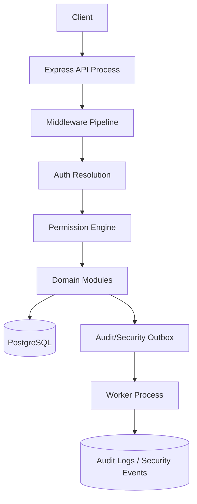
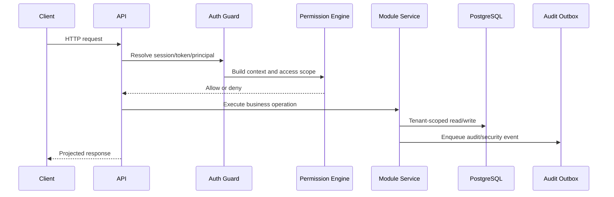

# Architecture Overview

This document explains the conceptual architecture behind the private enterprise backend foundation.

The public repository does not include source code. The goal is to show the structure, boundaries, and engineering decisions clearly enough for portfolio review and technical discussion.

## Design Goal

The private project is an active-development, production-oriented backend foundation for multi-tenant ERP and internal business applications.

It is not framed as a finished commercial product. It is a reusable foundation meant to support future domain modules without forcing each module to rebuild the same security, tenancy, validation, and audit controls.

The foundation focuses on platform concerns such as:

- authentication
- authorization
- tenant isolation
- audit and security logging
- response minimization
- request validation
- error handling
- observability
- deployment readiness
- regression testing for security-sensitive behavior

The main idea is simple: future modules should be able to add business behavior while reusing the same trusted security pipeline.

## High-Level Runtime Shape



The private implementation separated the request path from background audit/security materialization. The API process handles HTTP requests. A worker process dispatches durable outbox records into audit and security event storage.

## Conceptual Layers

### Core Layer

The core layer contains cross-cutting rules that modules should not reimplement locally:

- authentication and session logic
- access-control models and permission evaluation
- request context and access-scope building
- tenant and governance helpers
- audit/security event services
- middleware for request state, authorization, CSRF, rate limiting, body/content-type checks, and error handling
- response classification and field projection helpers
- shared utilities for safe application behavior

This layer is the application equivalent of a building's foundation. If every floor builds its own foundation, the building becomes unsafe. In this project, modules are expected to stand on one shared foundation.

### Infrastructure Layer

The infrastructure layer isolates runtime-facing concerns:

- environment validation
- database client setup
- logging
- telemetry
- password hashing
- token signing
- cryptographic helpers
- notification/delivery adapters where needed

The goal is to keep framework and platform details from leaking into business modules more than necessary.

### Module Layer

The module layer contains API-facing features and future business/domain modules.

Each module follows a predictable shape:

```text
src/modules/<module-key>/
  <module-key>.routes.ts
  <module-key>.controller.ts
  <module-key>.service.ts
  <module-key>.validators.ts
  <module-key>.types.ts
```

Optional files can exist when they have precise responsibilities, such as access-fact resolution, response projection, audit helpers, state machines, or calculation engines.

The intended dependency rule is:

```text
modules -> core + infrastructure
modules -x-> direct module-to-module shortcuts
```

Direct module-to-module shortcuts are avoided because they can accidentally bypass authorization, tenant checks, audit behavior, or projection rules.

### Worker and Tooling Layer

The private prototype also used non-request-path processes and tools:

- audit/security outbox worker
- audit hash-chain verification
- service-account bootstrap tooling
- authentication hot-path benchmark
- concurrent API smoke testing
- OpenAPI contract validation
- CI-style verification commands

These tools are important because enterprise backend quality is not only about route handlers. It also depends on repeatable validation, safe operational behavior, and failure visibility.

## Request Pipeline

The request pipeline is designed so that business logic runs only after the request has a safe security context.

Conceptual order:

1. Initialize request state.
2. Authenticate browser session, bearer token, or service-account token.
3. Resolve the authenticated principal.
4. Build trusted request context.
5. Build access scope.
6. Enforce route permission.
7. Execute controller and service logic.
8. Write audit/security events when required.
9. Return a projected and classified response.



Controllers should not make permission decisions themselves. Routes declare the required permission, and the permission engine evaluates the request using server-derived facts.

## Domain Module Contract

A future domain module is expected to follow these rules:

- validate request input before business logic
- receive tenant context from authenticated request state, not request body input
- load ownership, branch, team, classification, and relationship facts server-side
- declare explicit route permissions
- fail closed when required authorization facts cannot be resolved
- use field projection for sensitive response fields
- write audit/security events for high-impact actions
- document routes in OpenAPI
- add tests for tenant boundaries, authorization failures, validation, response leaks, audit/outbox behavior, and concurrency-sensitive cases

This is the safety contract that makes the foundation reusable.

## Why This Structure Matters

In multi-tenant business systems, the dangerous bugs are often small local shortcuts:

- one query forgets tenant scope
- one endpoint trusts a client-supplied owner ID
- one route bypasses permission middleware
- one controller returns a raw ORM object
- one module writes business data but skips audit evidence
- one token flow handles browser and API clients too loosely

The architecture attempts to reduce those risks by making authentication, authorization, tenant isolation, projection, auditing, and validation reusable defaults rather than optional habits.

## Portfolio Takeaway

This project is strongest when described as a backend foundation case study, not as a simple ERP screen project.

The valuable part is the system thinking: boundaries, central enforcement, failure modes, validation, and honest production-readiness limits.
