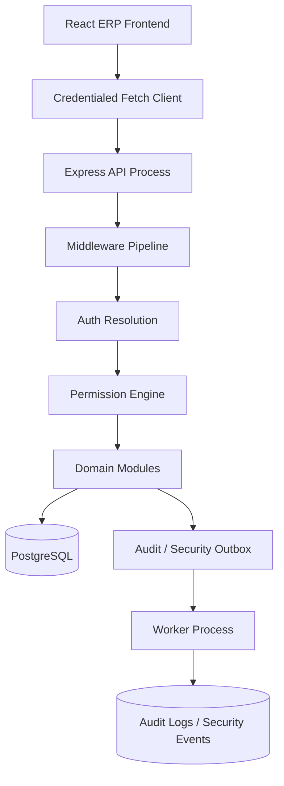
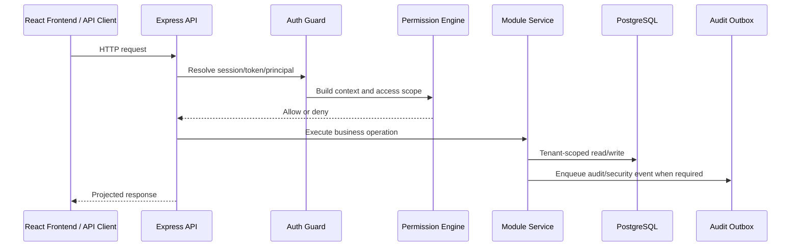

# Backend Architecture Overview

This document explains the backend architecture behind the private full-stack ERP/SaaS project.

The project originally began as a reusable backend foundation and later expanded with a separate operational React frontend. This file intentionally remains a **backend deep dive**. For the frontend side, see [Frontend Architecture and Integration](./frontend-architecture-and-integration.md).

The public repository does not include source code. The goal is to show the structure, boundaries, and engineering decisions clearly enough for portfolio review and technical discussion.

## Design Goal

The private project is an active-development, production-oriented multi-tenant ERP/SaaS platform. Its backend foundation is designed so current and future domain modules can reuse the same security, tenancy, validation, audit, and operational controls instead of rebuilding them independently.

It is not framed as a finished commercial product or a certified production platform.

The backend focuses on:

- authentication and session security
- authorization
- tenant isolation
- audit and security logging
- response minimization and field projection
- request validation
- error handling
- observability
- deployment readiness
- security-sensitive regression testing
- reusable module boundaries

The main idea is simple: domain behavior can vary, but shared security and governance controls should not be optional habits.

## Full-Stack Runtime Context


```mermaid
flowchart TD
    Frontend[React ERP Frontend] --> Client[Credentialed Fetch Client]
    Client --> API[Express API Process]
    API --> Middleware[Middleware Pipeline]
    Middleware --> Auth[Auth Resolution]
    Auth --> Permission[Permission Engine]
    Permission --> Modules[Domain Modules]
    Modules --> Database[(PostgreSQL)]
    Modules --> Outbox[Audit / Security Outbox]
    Outbox --> Worker[Worker Process]
    Worker --> Audit[(Audit Logs / Security Events)]
```

The frontend can use bootstrap, capability, and permission information to shape the user experience, but backend authorization remains authoritative. A hidden button is not a security control.

## Backend Layers

### Core Layer

The core layer contains cross-cutting rules that modules should not reimplement locally:

- authentication and session logic
- access-control models and permission evaluation
- request context and access-scope building
- tenant and governance helpers
- audit/security event services
- middleware for request state, authorization, CSRF, rate limiting, body/content-type checks, and error handling
- response classification and field-projection helpers
- shared safe-application utilities

This layer is the application equivalent of a building foundation. If every floor builds its own foundation, the overall structure becomes inconsistent and unsafe.

### Infrastructure Layer

The infrastructure layer isolates runtime-facing concerns such as:

- environment validation
- database client setup
- logging and telemetry
- password hashing
- token signing
- cryptographic helpers
- notification/delivery adapters where needed

The goal is to keep infrastructure and platform details from leaking into domain logic more than necessary.

### Module Layer

The module layer contains API-facing business capabilities.

A representative module shape is:

```text
src/modules/<module-key>/
  <module-key>.routes.ts
  <module-key>.controller.ts
  <module-key>.service.ts
  <module-key>.validators.ts
  <module-key>.types.ts
```

Optional files are added for precise responsibilities such as access-fact resolution, response projection, audit helpers, state machines, or calculation engines.

The intended dependency rule is:

```text
modules -> core + infrastructure
modules -x-> uncontrolled module-to-module shortcuts
```

Direct shortcuts are avoided because they can accidentally bypass authorization, tenant checks, auditing, or projection rules.

### Worker and Tooling Layer

The private implementation also uses processes and tools outside the synchronous request path, including:

- audit/security outbox worker
- audit hash-chain verification
- service-account tooling
- authentication hot-path benchmarks
- concurrent API smoke testing
- OpenAPI contract validation
- CI-style verification commands

Enterprise backend quality is not only about route handlers. Repeatable validation, failure visibility, and operational behavior matter as well.

## Request Pipeline

Business logic is expected to run only after the request has a trustworthy security context.

Conceptual order:

1. Initialize request state.
2. Authenticate browser session, bearer token, or service-account token.
3. Resolve the authenticated principal.
4. Build trusted request and tenant context.
5. Build access scope.
6. Enforce route permission.
7. Execute controller/service behavior.
8. Persist business data with tenant-safe constraints.
9. Write or enqueue audit/security evidence when required.
10. Return a classified and projected response.


```mermaid
sequenceDiagram
    participant F as React Frontend / API Client
    participant A as Express API
    participant Auth as Auth Guard
    participant P as Permission Engine
    participant M as Module Service
    participant DB as PostgreSQL
    participant O as Audit Outbox

    F->>A: HTTP request
    A->>Auth: Resolve session/token/principal
    Auth->>P: Build context and access scope
    P-->>A: Allow or deny
    A->>M: Execute business operation
    M->>DB: Tenant-scoped read/write
    M->>O: Enqueue audit/security event when required
    A-->>F: Projected response
```

Controllers do not become the source of permission decisions. Routes declare required access, and the permission engine evaluates trusted server-derived facts.

## Domain Module Contract

A domain module is expected to follow rules such as:

- validate input before business logic
- derive tenant context from authenticated request state rather than request body input
- load ownership, branch, team, classification, and relationship facts server-side
- declare explicit route permissions
- fail closed when required authorization facts cannot be resolved
- use field projection for sensitive response fields
- write audit/security evidence for high-impact actions
- document routes in OpenAPI
- add tests for tenant boundaries, authorization failures, validation, response leaks, audit/outbox behavior, and concurrency-sensitive cases

This is the safety contract that makes the backend reusable across different ERP and vertical-product modules.

## Why This Structure Matters

In multi-tenant business systems, dangerous failures often begin as small local shortcuts:

- one query forgets tenant scope
- one endpoint trusts a client-supplied owner or branch fact
- one route bypasses permission middleware
- one controller returns a raw ORM object
- one mutation updates business data but skips audit evidence
- one browser flow treats client-side visibility as authorization

The architecture attempts to reduce those risks by making authentication, tenant context, authorization, projection, auditing, and validation reusable defaults.

## Portfolio Takeaway

This backend remains one of the strongest technical parts of the project, but it is no longer the whole project.

The current portfolio story is a **full-stack ERP/SaaS platform built on a security-conscious multi-tenant backend foundation**, with the frontend now exercising real browser-session, API-contract, permission-aware, and ERP workflow concerns.
