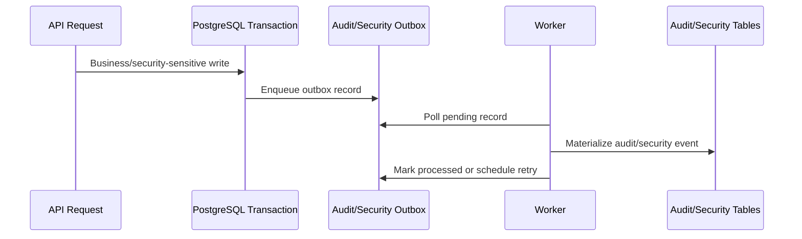
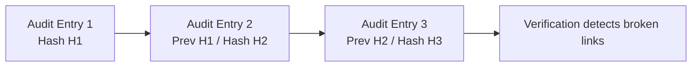

# Audit and Integrity

This document summarizes the audit and integrity model explored in the private enterprise backend foundation.

The design goal is not to claim absolute immutability. The goal is to make important application-level changes traceable and tamper-evident under normal application operation.

## Audit vs Security Events

The private prototype separated two related concepts:

| Concept | Purpose |
|---|---|
| Audit logs | Records of business, administrative, or domain actions. |
| Security events | Records of authentication, authorization, credential, token, session, and suspicious activity events. |

This separation allows operational history and security monitoring to evolve independently.

For example, a sales order status change and a suspicious refresh-token reuse attempt should not be treated as the same kind of event, even though both may matter during an investigation.

## Durable Outbox Pattern

Audit and security writes were designed to flow through a durable outbox.

Conceptual flow:

Intended behavior:

1. The API request performs a business or security-sensitive action.
2. The application enqueues an outbox record.
3. A worker process materializes that record into the durable audit or security-event table.
4. Failed processing is retried with bounded backoff.
5. Unrecoverable records can move to dead-letter state for investigation.

This keeps the request path resilient while still preserving security and audit visibility.

## Tamper-Evident Hash Chain

Audit logs were designed with a per-tenant hash-chain strategy.

Conceptually, each new audit entry includes:

- the previous audit entry hash for that tenant
- the canonicalized payload of the new entry
- the computed hash for the new entry

This makes historical modification, deletion, or ordering changes detectable when the chain is verified.

## Concurrency Consideration

A key challenge for audit hash chains is concurrent writes.

If two workers append audit entries for the same tenant at the same time, both could read the same previous hash and create a forked chain.

The private prototype addressed this by using tenant-scoped transaction locking during hash-chain append so that each tenant's audit chain is appended deterministically.

In simpler terms: only one worker should be allowed to add the next link for the same tenant at the same time.

## What This Provides

The design provides:

- tamper evidence for audit-log ordering inside a tenant
- detection support if historical audit rows are changed or removed
- deterministic append behavior under concurrent worker execution
- a clear verification command in the private repository
- a stronger incident-investigation trail for security-sensitive actions
- separation between product-facing status history and security/accountability evidence

## What This Does Not Provide

This design does not make database storage immutable by itself.

It also does not prove integrity if an attacker controls the database, backups, application code, and every external copy of the audit trail.

For stronger production guarantees, the system would need additional operational controls such as:

- protected backups
- external log export
- SIEM integration
- object-lock storage
- external hash anchoring
- incident response procedures
- periodic verification jobs
- restricted database access policies

## Correct Claim

The correct claim is **tamper-evident**, not **tamper-proof**.

In a hosted SaaS model, the provider can protect database access, application code, audit trails, and external logs more strongly.

In a self-hosted or root-access environment, infrastructure administrators may be able to modify data, code, or logs. In that model, audit integrity claims should be phrased as application-level tamper evidence unless external anchoring, protected backups, or third-party log export are added.

## Portfolio Takeaway

The professional value of this design is not pretending to solve every audit problem.

The value is recognizing where application-level audit integrity helps, where it stops, and what operational controls would be needed before claiming stronger production guarantees.
