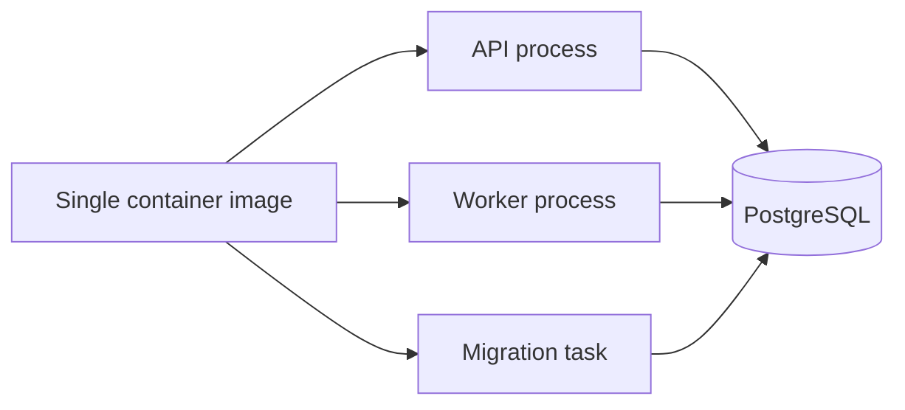

# Deployment Notes

This document summarizes the deployment and runtime concerns explored in the private enterprise backend foundation.

The public repository does not include runnable deployment templates. This document describes design considerations only.

## Runtime Shape

The private prototype used a split runtime model:

- API process for HTTP requests
- worker process for audit/security outbox dispatch
- PostgreSQL as the source of truth for sessions, token state, outbox records, audit logs, security events, and business data
- migration process before new runtime releases

The API and worker were intended to be stateless at the application-process level.

In simple terms: if an API container restarts, it should not lose session, audit, or business state because those belong in PostgreSQL, not in process memory.

## Runtime Flow

The same immutable image can support different commands for API, worker, and migration tasks.

## Container And Runtime Hardening Ideas

The private Docker design explored several runtime practices:

- multi-stage build
- production dependency install in the runtime layer
- configuration supplied through environment variables
- stdout-only logging
- non-root runtime user
- separate API and worker commands from the same immutable image
- committed migrations available to the runtime image
- runtime checks for expected process behavior
- dependency and image review gates

## Environment Validation

The private prototype included fail-fast environment validation for sensitive configuration.

Important deployment checks included:

- production/staging environments should not allow credentialed wildcard CORS
- production cookies should be secure
- trusted proxy hop count should match the real infrastructure topology
- API docs should be disabled by default in production unless explicitly enabled
- outbound notification delivery should use a trusted channel in production-like environments
- application encryption keys should not use development defaults in production
- request body limits should be explicit

## CI/CD Validation Strategy

The private repository included a multi-layer validation approach:

| Layer | Examples |
|---|---|
| Code contract | Typecheck, lint, formatting, OpenAPI validation, tests, dependency audit, build |
| Platform checks | Docker build, Compose validation, Kubernetes-style manifest rendering, ECS-style template validation |
| Runtime checks | Non-root execution and expected runtime behavior |
| Integration checks | PostgreSQL service, migrations, seed data, integration tests, hash-chain verification, performance smoke checks |
| Security review | Dependency audit and container review gates |

## Production Considerations Not Fully Solved By Code

A backend foundation can provide good defaults, but real production readiness also depends on operational controls.

Before a real enterprise deployment, the following should be planned:

- managed database strategy
- backup and restore runbooks
- migration rollback strategy
- log and audit retention policy
- monitoring dashboards
- alerting for outbox dead-letter growth and security events
- configuration and key rotation process
- incident response procedure
- periodic dependency and runtime reviews
- realistic load testing
- data retention and deletion workflows
- disaster recovery exercises

## Hosted vs Self-Hosted Integrity

The audit integrity story depends on deployment ownership.

In a managed SaaS model, the provider can protect database access, application code, audit trails, and external logs more strongly.

In a self-hosted or customer-root-access model, infrastructure administrators may be able to modify data, code, or logs. In that model, audit integrity claims should be phrased as application-level tamper evidence unless external anchoring, protected backups, or third-party log export are added.

## Correct Portfolio Claim

The deployment work should not be presented as “production already solved.”

A more accurate claim is:

> The private prototype explored production-oriented runtime structure, CI gates, environment validation, container hardening, and operational boundaries.

That wording shows maturity without overstating the system's current status.

## Portfolio Takeaway

The deployment work was not only about making the application start in a container.

The main lesson was that production readiness is a combination of application design, runtime hardening, CI gates, environment validation, operational runbooks, and honest boundaries around what the software can and cannot guarantee by itself.
