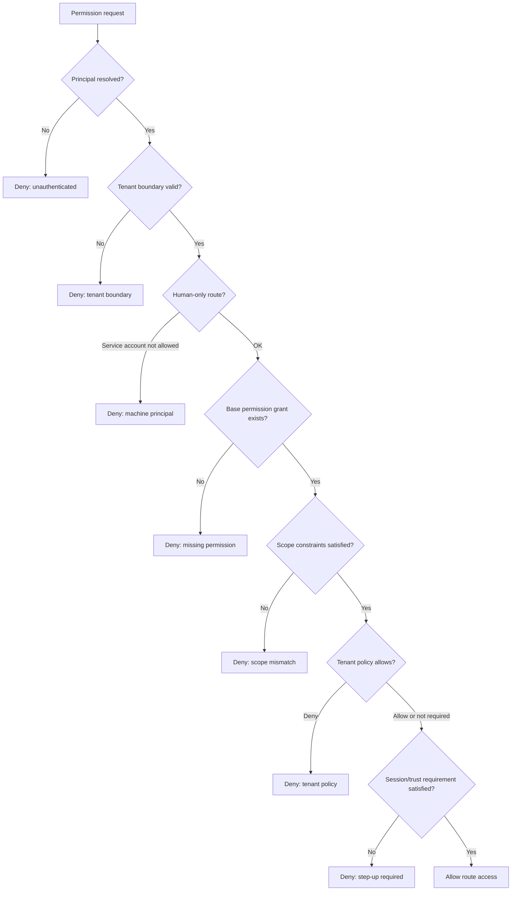

# Permission Engine Decision Flow

This document explains the conceptual decision flow of the permission engine in the private backend foundation.

The permission engine is the heart of the authorization model. It is the place where identity, tenant boundary, route permission, scoped grants, relationships, tenant policies, session trust, and resource facts come together into one final decision.

This public document does not expose private source code. It explains the decision model at an architecture level.

## Why The Permission Engine Matters

In a multi-tenant business backend, authorization is not just a question of whether a user has a role.

A safe decision may need to know:

- who the authenticated principal is
- whether the principal is a human user or service account
- which tenant the request belongs to
- what route permission is required
- what resource is being accessed
- which branch, department, team, or custom dimension owns that resource
- whether the principal has the right role grant
- whether tenant policies deny or allow the action
- whether a relationship exists between the principal and the resource
- whether the session has enough trust for a sensitive action
- whether the response should expose restricted fields after the route is allowed

If every controller tries to answer those questions locally, the system becomes inconsistent. The permission engine exists to make those decisions centralized and predictable.

## Decision Inputs

A permission decision conceptually receives:

| Input | Purpose |
|---|---|
| Principal | The authenticated user, service account, or system actor. |
| Tenant context | The tenant boundary for the request. |
| Permission key | The named permission required by the route. |
| Resource type | The kind of object being accessed. |
| Action | The operation being attempted, such as read, create, update, transition, or manage. |
| Resource ID | Exact object ID when object-level access matters. |
| Resource owner | Server-derived owner user ID when ownership or manager-style access matters. |
| Resource dimensions | Server-derived branch, department, team, region, location, or custom dimensions. |
| Resource attributes | Server-derived classification or other trusted attributes. |
| Access scope | Roles, permissions, scope constraints, relationships, policies, and trust facts available to the principal. |

The most important rule: sensitive access facts should come from trusted server-side data, not from request body claims.

## High-Level Decision Flow



## Step-By-Step Explanation

### 1. Principal resolution

The engine assumes that authentication has already resolved a principal.

The principal may be:

- a human user
- a service account
- a system/internal actor

If there is no principal for a protected route, the decision is denied before business logic runs.

### 2. Tenant boundary check

Tenant boundary is evaluated before business permission details.

This prevents a role or relationship grant from being used against another tenant's object.

The simple rule is:

> A permission is not meaningful until the system proves that the target object belongs to the same allowed tenant context.

### 3. Principal-type guard

Some operations require a human actor.

For example, a service account should not be allowed to perform a human-only workflow just because it has a broad technical permission.

This avoids confusing machine credentials with real user intent.

### 4. Base permission grant

The engine checks whether the principal has the named permission required by the route.

This is the RBAC-style part of the decision.

Example permission concepts:

```text
users.read
sales.orders.create
audit-logs.read
service-accounts.manage
```

A base grant is necessary, but it is not always sufficient.

### 5. Scope constraints

A permission may be limited by scope.

Examples:

- own records only
- same branch only
- same department only
- same team only
- required resource relationship
- required owner relationship
- required resource classification
- required custom tenant dimension

If a scope requires a resource fact, the route must provide that fact from trusted server-side data.

If the fact is missing, the safe result is deny.

### 6. Relationship checks

ReBAC-style checks are used when access depends on a relationship.

A safe relationship check should be exact:

```text
tenant + subject + relation + resource type + resource id
```

A vague relationship such as “manager” is not enough. The decision should know which resource is being accessed.

### 7. Tenant policy checks

PBAC-style rules allow tenant-level policy decisions.

The intended behavior is:

- matching deny policies win first
- if allow policies exist for a resource/action, at least one matching allow should pass
- if no policy applies, the engine continues with the normal grant and scope result

This lets tenant governance add stricter local rules without rewriting every module.

### 8. Session or trust requirement

Some sensitive actions may require a stronger session state.

For example, the route may require a recent step-up verification before allowing a high-impact operation.

The permission engine can treat insufficient trust as a denied decision with a clear reason, rather than letting the controller make a local guess.

### 9. Final route decision

The final decision should be explicit:

```text
allow
```

or

```text
deny with reason
```

Reasoned denial matters for testing, logging, audit review, and debugging.

## Field Projection Happens After Route Access

The permission engine decides whether the route action is allowed.

Field projection is a separate step.

A user may be allowed to list records but still not be allowed to see restricted fields. That is why response minimization is documented separately in [Data Classification](./data-classification.md).

## Common Failure Modes This Design Tries To Avoid

| Failure mode | Safer behavior |
|---|---|
| Controller performs its own custom permission check | Route uses centralized permission middleware and engine. |
| Route trusts owner or branch from request body | Route resolves facts from server/database. |
| Missing branch/team/owner fact is ignored | Decision fails closed. |
| Service account acts like a human user | Human-only routes reject machine principals. |
| Tenant policy is checked after business write | Policy participates before the operation runs. |
| Broad route access exposes sensitive fields | Field projection controls restricted response fields separately. |

## Portfolio Takeaway

The permission engine is important because it turns many small security questions into one repeatable decision process.

The professional lesson is not just “I added roles.”

The stronger lesson is:

> I designed the authorization model around tenant boundaries, server-derived facts, scoped grants, relationship checks, policy rules, trust requirements, explicit denial reasons, and separate response projection.
