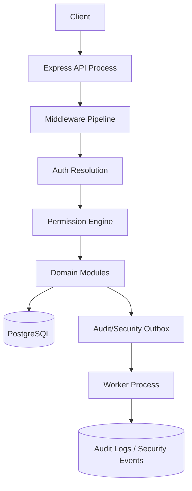
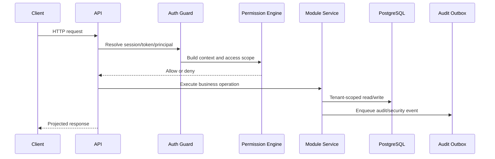

# Architecture Overview

Bu doküman, private enterprise backend foundation arkasındaki kavramsal mimariyi açıklar.

Public repository source code içermez. Amaç; yapıyı, sınırları ve engineering kararlarını portfolio review ve teknik tartışma için yeterince net göstermektir.

## Design Goal

Private proje; multi-tenant ERP ve internal business applications için aktif geliştirme aşamasındaki, production-oriented bir backend foundation olarak tasarlanmıştır.

Finished commercial product olarak sunulmaz. Her domain module'ün authentication, authorization, tenancy, validation ve audit kontrollerini tekrar tekrar yazmasını önleyen reusable bir foundation hedeflenir.

Foundation şu platform konularına odaklanır:

- authentication
- authorization
- tenant isolation
- audit and security logging
- response minimization
- request validation
- error handling
- observability
- deployment readiness
- security-sensitive behavior için regression testing

Ana fikir: future modules business behavior ekleyebilmeli ama aynı trusted security pipeline'ı kullanmalıdır.

## High-Level Runtime Shape



Private implementation, request path ile background audit/security materialization işini ayırır. API process HTTP requests'i karşılar. Worker process durable outbox records'ı audit ve security event storage'a işler.

## Conceptual Layers

### Core Layer

Core layer, modüllerin lokal olarak yeniden yazmaması gereken cross-cutting rules içerir:

- authentication ve session logic
- access-control models ve permission evaluation
- request context ve access-scope building
- tenant ve governance helpers
- audit/security event services
- request state, authorization, CSRF, rate limiting, body/content-type checks ve error handling middleware'leri
- response classification ve field projection helpers
- safe application behavior için shared utilities

Bu layer uygulamanın bina temeli gibidir. Her kat kendi temelini atarsa bina güvenli olmaz. Bu projede modüllerin tek shared foundation üzerinde durması beklenir.

### Infrastructure Layer

Infrastructure layer runtime-facing concerns'ü izole eder:

- environment validation
- database client setup
- logging
- telemetry
- password hashing
- token signing
- cryptographic helpers
- gerektiğinde notification/delivery adapters

Amaç framework ve platform detaylarının business modules içine gereğinden fazla sızmasını engellemektir.

### Module Layer

Module layer API-facing features ve gelecekteki business/domain modules içerir.

Her modül predictable bir şekil izler:

```text
src/modules/<module-key>/
  <module-key>.routes.ts
  <module-key>.controller.ts
  <module-key>.service.ts
  <module-key>.validators.ts
  <module-key>.types.ts
```

Optional dosyalar precise responsibility taşıdığında kullanılabilir: access-fact resolution, response projection, audit helpers, state machines veya calculation engines gibi.

Beklenen dependency rule:

```text
modules -> core + infrastructure
modules -x-> direct module-to-module shortcuts
```

Direct module-to-module shortcuts kaçınılır; çünkü authorization, tenant checks, audit behavior veya projection rules yanlışlıkla bypass edilebilir.

### Worker and Tooling Layer

Private prototype ayrıca non-request-path processes ve tools kullanır:

- audit/security outbox worker
- audit hash-chain verification
- service-account bootstrap tooling
- authentication hot-path benchmark
- concurrent API smoke testing
- OpenAPI contract validation
- CI-style verification commands

Enterprise backend kalitesi sadece route handler yazmak değildir. Repeatable validation, safe operational behavior ve failure visibility de önemlidir.

## Request Pipeline

Request pipeline, business logic çalışmadan önce request'in safe security context'e sahip olmasını sağlar.

Kavramsal sıra:

1. Request state initialize edilir.
2. Browser session, bearer token veya service-account token authenticate edilir.
3. Authenticated principal resolve edilir.
4. Trusted request context build edilir.
5. Access scope build edilir.
6. Route permission enforce edilir.
7. Controller ve service logic çalışır.
8. Gerekirse audit/security events yazılır.
9. Projected ve classified response döndürülür.



Controller'lar permission decision vermemelidir. Route gerekli permission'ı declare eder; permission engine trusted server-derived facts ile request'i değerlendirir.

## Domain Module Contract

Future domain module'ün şu kuralları izlemesi beklenir:

- business logic öncesi request input validate edilmeli
- tenant context request body'den değil authenticated request state'ten alınmalı
- ownership, branch, team, classification ve relationship facts server-side yüklenmeli
- explicit route permissions declare edilmeli
- required authorization facts resolve edilemiyorsa fail closed davranılmalı
- sensitive response fields için field projection kullanılmalı
- high-impact actions için audit/security events yazılmalı
- routes OpenAPI içinde documented olmalı
- tenant boundaries, authorization failures, validation, response leaks, audit/outbox behavior ve concurrency-sensitive cases test edilmeli

Bu contract, foundation'ı reusable yapan güvenlik sözleşmesidir.

## Why This Structure Matters

Multi-tenant business systems içinde tehlikeli bug'lar genelde küçük lokal shortcut'lardan çıkar:

- bir query tenant scope'u unutur
- bir endpoint client-supplied owner ID'ye güvenir
- bir route permission middleware'i bypass eder
- bir controller raw ORM object döndürür
- bir module business data yazar ama audit evidence atlar
- bir token flow browser ve API clients ayrımını bulanıklaştırır

Architecture; authentication, authorization, tenant isolation, projection, auditing ve validation'ı optional habits değil reusable defaults yaparak bu riskleri azaltmaya çalışır.

## Portfolio Takeaway

Bu proje en güçlü şekilde basit ERP ekran projesi değil, backend foundation case study olarak anlatılır.

Değerli taraf system thinking'dir: boundaries, central enforcement, failure modes, validation ve honest production-readiness limits.
