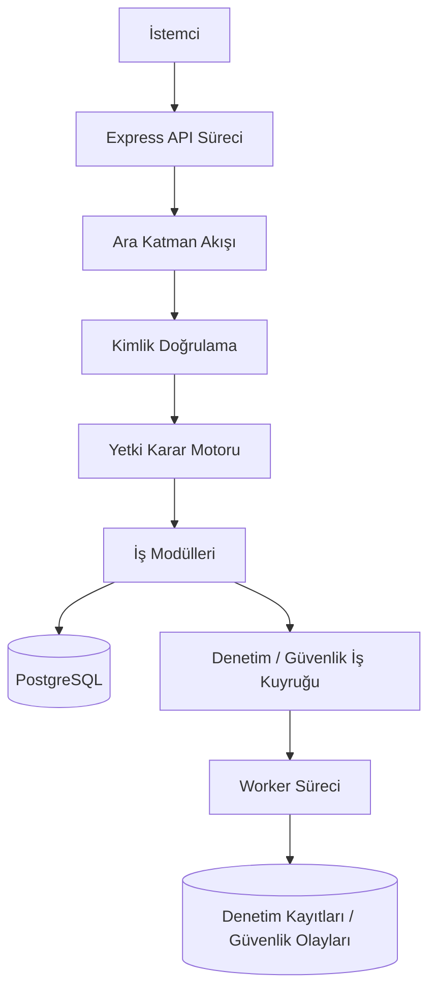

# Mimari Genel Bakış

Bu doküman, özel backend altyapı temelinin kavramsal mimarisini açıklar.

Herkese açık repository kaynak kod içermez. Amaç; yapıyı, sınırları ve mühendislik kararlarını portfolyo incelemesi ve teknik tartışma için yeterince net göstermektir.

## Tasarım Hedefi

Özel proje; çok kiracılı (multi-tenant) ERP ve iç iş uygulamaları için aktif geliştirme aşamasındaki, üretim ortamına hazırlık hedefli (production-oriented) bir backend altyapı temeli olarak tasarlanmıştır.

Bitmiş ticari ürün olarak sunulmaz. Her iş modülünün kimlik doğrulama, yetkilendirme, kiracı yalıtımı, doğrulama ve denetim kontrollerini tekrar tekrar yazmasını önleyen yeniden kullanılabilir bir temel hedeflenir.

Bu altyapı şu platform konularına odaklanır:

- kimlik doğrulama (authentication)
- yetkilendirme (authorization)
- kiracı yalıtımı (tenant isolation)
- denetim ve güvenlik kayıtları
- yanıt sadeleştirme (response minimization)
- istek doğrulama
- hata yönetimi
- gözlemlenebilirlik
- dağıtım hazırlığı
- güvenliğe duyarlı davranışlar için regresyon testleri

Ana fikir: Gelecekteki modüller iş davranışı ekleyebilmeli, ancak aynı güvenilir güvenlik akışını kullanmalıdır.

## Üst Düzey Çalışma Yapısı



Özel uygulama, istek akışı ile arka plan denetim/güvenlik işleme sürecini ayırır. API süreci HTTP isteklerini karşılar. Worker süreci ise dayanıklı iş kuyruğundaki kayıtları denetim ve güvenlik olaylarına dönüştürür.

## Kavramsal Katmanlar

### Çekirdek Katman

Çekirdek katman, modüllerin yerel olarak yeniden yazmaması gereken ortak kuralları içerir:

- kimlik doğrulama ve oturum mantığı
- erişim kontrol modelleri ve yetki değerlendirmesi
- istek bağlamı ve erişim kapsamı oluşturma
- kiracı ve yönetişim yardımcıları
- denetim/güvenlik olayı servisleri
- istek durumu, yetkilendirme, CSRF, hız sınırlama, içerik kontrolü ve hata yönetimi ara katmanları
- yanıt sınıflandırma ve alan filtreleme yardımcıları
- güvenli uygulama davranışı için ortak yardımcılar

Bu katman uygulamanın bina temeli gibidir. Her kat kendi temelini atarsa bina güvenli olmaz. Bu projede modüllerin tek ortak temel üzerinde durması beklenir.

### Altyapı Katmanı

Altyapı katmanı çalışma zamanı ve platforma dönük konuları izole eder:

- ortam doğrulama
- veritabanı istemcisi kurulumu
- kayıt/loglama
- telemetri
- parola özetleme
- token imzalama
- kriptografik yardımcılar
- gerektiğinde bildirim veya teslimat bağdaştırıcıları

Amaç, framework ve platform detaylarının iş modüllerinin içine gereğinden fazla sızmasını engellemektir.

### Modül Katmanı

Modül katmanı API'ye açık özellikleri ve gelecekteki iş modüllerini içerir.

Her modül öngörülebilir bir şekil izler:

```text
src/modules/<module-key>/
  <module-key>.routes.ts
  <module-key>.controller.ts
  <module-key>.service.ts
  <module-key>.validators.ts
  <module-key>.types.ts
```

Opsiyonel dosyalar yalnızca net bir sorumluluğa sahipse kullanılmalıdır: erişim bilgisi çözümleme, yanıt alanı filtreleme, denetim yardımcıları, durum makineleri veya hesaplama motorları gibi.

Beklenen bağımlılık kuralı:

```text
modules -> core + infrastructure
modules -x-> direct module-to-module shortcuts
```

Modülden modüle doğrudan kısayollardan kaçınılır; çünkü yetkilendirme, kiracı kontrolleri, denetim davranışı veya alan filtreleme kuralları yanlışlıkla atlanabilir.

### Worker ve Araç Katmanı

Özel prototip ayrıca istek akışının dışında çalışan süreçler ve araçlar kullanır:

- denetim/güvenlik iş kuyruğu worker süreci
- denetim kayıt zinciri doğrulama aracı
- servis hesabı hazırlama aracı
- kimlik doğrulama sıcak yol performans ölçümü
- eşzamanlı API duman testi
- OpenAPI sözleşme doğrulaması
- CI tarzı doğrulama komutları

Kurumsal backend kalitesi yalnızca rota handler yazmak değildir. Tekrarlanabilir doğrulama, güvenli operasyonel davranış ve hata görünürlüğü de önemlidir.

## İstek Akışı

İstek akışı, iş mantığı çalışmadan önce isteğin güvenli bir bağlama sahip olmasını sağlar.

Kavramsal sıra:

1. İstek durumu başlatılır.
2. Tarayıcı oturumu, bearer token veya servis hesabı kimliği doğrulanır.
3. Kimliği doğrulanmış aktör çözülür.
4. Güvenilir istek bağlamı oluşturulur.
5. Erişim kapsamı oluşturulur.
6. Rota izni uygulanır.
7. Controller ve servis mantığı çalışır.
8. Gerekirse denetim/güvenlik olayları yazılır.
9. Alanları filtrelenmiş ve sınıflandırılmış yanıt döndürülür.

Controller'lar yetki kararı vermemelidir. Rota gerekli izni bildirir; yetki karar motoru güvenilir sunucu verileriyle isteği değerlendirir.

## İş Modülü Sözleşmesi

Gelecekteki iş modülünün şu kuralları izlemesi beklenir:

- iş mantığından önce istek girdisi doğrulanmalı
- kiracı bağlamı istek gövdesinden değil kimliği doğrulanmış istek durumundan alınmalı
- sahiplik, şube, ekip, sınıflandırma ve ilişki bilgileri sunucu tarafında yüklenmeli
- açık rota izinleri bildirilmeli
- gerekli yetkilendirme bilgileri çözülemiyorsa güvenli biçimde reddedilmeli
- hassas yanıt alanları için alan filtreleme kullanılmalı
- yüksek etkili işlemler için denetim/güvenlik olayları yazılmalı
- rotalar OpenAPI içinde belgelenmeli
- kiracı sınırları, yetkilendirme hataları, doğrulama, yanıt sızıntıları, iş kuyruğu davranışı ve eşzamanlılık durumları test edilmeli

Bu sözleşme, altyapı temelini yeniden kullanılabilir yapan güvenlik anlaşmasıdır.

## Neden Önemli?

Çok kiracılı iş sistemlerinde tehlikeli hatalar genelde küçük yerel kısayollardan çıkar:

- bir sorgu kiracı kapsamını unutur
- bir endpoint istemciden gelen sahiplik bilgisine güvenir
- bir rota yetkilendirme ara katmanını atlar
- bir controller ham ORM nesnesi döndürür
- bir modül iş verisi yazar ama denetim kaydını atlar

Mimari; kimlik doğrulama, yetkilendirme, kiracı yalıtımı, alan filtreleme, denetim ve doğrulamayı isteğe bağlı alışkanlıklar yerine yeniden kullanılabilir varsayılanlar yaparak bu riskleri azaltmaya çalışır.

## Portfolyo Çıkarımı

Bu proje en güçlü şekilde basit ERP ekran projesi değil, backend altyapı temeli case study'si olarak anlatılır.

Değerli taraf sistem düşüncesidir: sınırlar, merkezi uygulama noktaları, hata biçimleri, doğrulama ve dürüst üretim sınırları.
