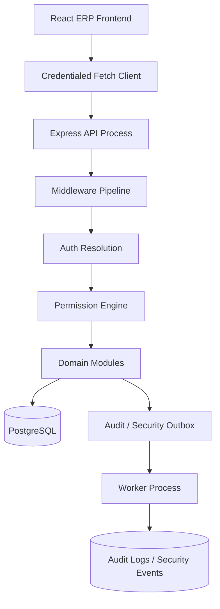
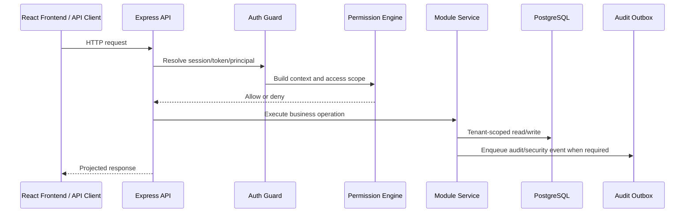

# Backend Mimari Genel Bakış

Bu doküman, private full-stack ERP/SaaS projesinin backend mimarisini açıklar.

Proje ilk olarak yeniden kullanılabilir bir backend foundation şeklinde başladı ve daha sonra ayrı bir operasyonel React frontend ile genişledi. Bu dosya bilinçli olarak **backend deep dive** olarak kalır. Frontend tarafı için [Frontend Mimari ve Entegrasyon](./frontend-architecture-and-integration.md) dosyasına bakılmalıdır.

Public repository kaynak kod içermez. Amaç; yapıyı, sınırları ve mühendislik kararlarını portfolyo incelemesi ve teknik tartışma için yeterince açık göstermektir.

## Tasarım Hedefi

Private proje aktif geliştirme aşamasındaki, production-oriented, multi-tenant ERP/SaaS platformudur. Backend foundation; mevcut ve gelecekteki domain modüllerinin aynı security, tenancy, validation, audit ve operational controls'ü yeniden yazmadan kullanabilmesi için tasarlanmıştır.

Bitmiş ticari ürün veya sertifikalı production platform olarak sunulmaz.

Backend şu konulara odaklanır:

- authentication ve session security
- authorization
- tenant isolation
- audit ve security logging
- response minimization ve field projection
- request validation
- error handling
- observability
- deployment readiness
- security-sensitive regression testing
- reusable module boundaries

Ana fikir basittir: domain davranışları değişebilir, fakat ortak security ve governance kontrolleri isteğe bağlı alışkanlıklar olmamalıdır.

## Full-Stack Runtime Bağlamı


```mermaid
flowchart TD
    Frontend[React ERP Frontend] --> Client[Credentialed Fetch Client]
    Client --> API[Express API Process]
    API --> Middleware[Middleware Pipeline]
    Middleware --> Auth[Auth Resolution]
    Auth --> Permission[Permission Engine]
    Permission --> Modules[Domain Modules]
    Modules --> Database[(PostgreSQL)]
    Modules --> Outbox[Audit / Security Outbox]
    Outbox --> Worker[Worker Process]
    Worker --> Audit[(Audit Logs / Security Events)]
```

Frontend bootstrap, capability ve permission bilgilerini UX'i şekillendirmek için kullanabilir; fakat backend authorization authoritative kalır. Bir butonu gizlemek güvenlik kontrolü değildir.

## Backend Katmanları

### Core Layer

Core layer, modüllerin kendi içinde tekrar yazmaması gereken ortak kuralları içerir:

- authentication ve session logic
- access-control models ve permission evaluation
- request context ve access-scope building
- tenant ve governance helpers
- audit/security event services
- request state, authorization, CSRF, rate limiting, body/content-type checks ve error handling middleware'leri
- response classification ve field-projection helpers
- ortak safe-application utilities

Bu katman uygulamanın bina temeli gibidir. Her kat kendi temelini atarsa bütün yapı tutarsız ve güvensiz hale gelir.

### Infrastructure Layer

Infrastructure layer runtime-facing konuları izole eder:

- environment validation
- database client setup
- logging ve telemetry
- password hashing
- token signing
- cryptographic helpers
- gerektiğinde notification/delivery adapters

Amaç, infrastructure ve platform detaylarının domain logic içine gereğinden fazla sızmasını önlemektir.

### Module Layer

Module layer API'ye açık business capabilities içerir.

Temsili module yapısı:

```text
src/modules/<module-key>/
  <module-key>.routes.ts
  <module-key>.controller.ts
  <module-key>.service.ts
  <module-key>.validators.ts
  <module-key>.types.ts
```

Access-fact resolution, response projection, audit helpers, state machines veya calculation engines gibi net sorumluluklar için ek dosyalar kullanılabilir.

Beklenen dependency rule:

```text
modules -> core + infrastructure
modules -x-> uncontrolled module-to-module shortcuts
```

Doğrudan kısayollardan kaçınılır; çünkü authorization, tenant checks, auditing veya projection rules yanlışlıkla atlanabilir.

### Worker ve Tooling Layer

Private implementation synchronous request path dışında da süreçler ve araçlar kullanır:

- audit/security outbox worker
- audit hash-chain verification
- service-account tooling
- authentication hot-path benchmark
- concurrent API smoke testing
- OpenAPI contract validation
- CI-style verification commands

Enterprise backend kalitesi yalnızca route handler yazmak değildir. Repeatable validation, failure visibility ve operational behavior da önemlidir.

## Request Pipeline

Business logic yalnızca request güvenilir bir security context kazandıktan sonra çalışmalıdır.

Kavramsal sıra:

1. Request state başlatılır.
2. Browser session, bearer token veya service-account token doğrulanır.
3. Authenticated principal çözülür.
4. Trusted request ve tenant context oluşturulur.
5. Access scope oluşturulur.
6. Route permission uygulanır.
7. Controller/service behavior çalışır.
8. Business data tenant-safe constraints ile işlenir.
9. Gerektiğinde audit/security evidence yazılır veya queue'ya alınır.
10. Classified ve projected response döndürülür.


```mermaid
sequenceDiagram
    participant F as React Frontend / API Client
    participant A as Express API
    participant Auth as Auth Guard
    participant P as Permission Engine
    participant M as Module Service
    participant DB as PostgreSQL
    participant O as Audit Outbox

    F->>A: HTTP request
    A->>Auth: Resolve session/token/principal
    Auth->>P: Build context and access scope
    P-->>A: Allow or deny
    A->>M: Execute business operation
    M->>DB: Tenant-scoped read/write
    M->>O: Enqueue audit/security event when required
    A-->>F: Projected response
```

Controller'lar permission decision kaynağı haline gelmez. Route gerekli access'i bildirir; permission engine trusted server-derived facts ile isteği değerlendirir.

## Domain Module Contract

Bir domain module şu tür kuralları izlemelidir:

- business logic öncesinde input validation
- tenant context'i request body yerine authenticated request state'ten üretme
- ownership, branch, team, classification ve relationship facts'i server-side yükleme
- explicit route permissions tanımlama
- gerekli authorization facts çözülemiyorsa fail closed davranma
- sensitive response fields için field projection kullanma
- high-impact actions için audit/security evidence üretme
- route'ları OpenAPI içinde belgeleme
- tenant boundaries, authorization failures, validation, response leaks, audit/outbox ve concurrency-sensitive cases için test ekleme

Bu safety contract, backend foundation'ın farklı ERP ve vertical-product modüllerinde yeniden kullanılabilmesini sağlar.

## Neden Önemli?

Multi-tenant business systems içindeki tehlikeli hatalar çoğu zaman küçük yerel kısayollardan çıkar:

- bir query tenant scope'u unutur
- bir endpoint client-supplied owner veya branch fact'e güvenir
- bir route permission middleware'i atlar
- bir controller raw ORM object döndürür
- bir mutation business data'yı değiştirir ama audit evidence üretmez
- bir browser flow client-side visibility'yi authorization sanır

Mimari; authentication, tenant context, authorization, projection, auditing ve validation'ı isteğe bağlı alışkanlıklar yerine reusable defaults haline getirerek bu riskleri azaltmayı amaçlar.

## Portfolyo Çıkarımı

Backend hâlâ projenin en güçlü teknik parçalarından biridir; fakat artık projenin tamamı değildir.

Güncel portfolyo anlatımı: **security-conscious multi-tenant backend foundation üzerinde geliştirilen full-stack ERP/SaaS platformu**. Frontend artık gerçek browser-session, API-contract, permission-aware UX ve ERP workflow konularıyla backend'i fiilen kullanmaktadır.
