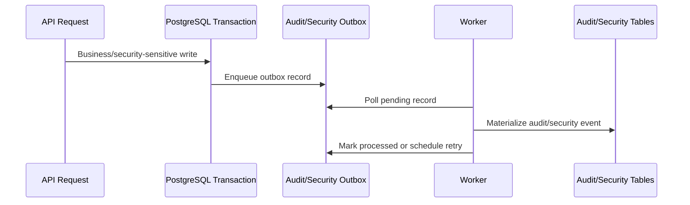
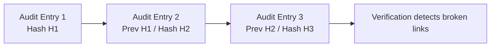

# Audit and Integrity

Bu doküman, private enterprise backend foundation içinde ele alınan audit ve integrity modelini özetler.

Design goal absolute immutability iddiası değildir. Amaç, important application-level changes'i traceable ve normal application operation altında tamper-evident hale getirmektir.

## Audit vs Security Events

Private prototype iki ilişkili kavramı ayırır:

| Kavram | Amaç |
|---|---|
| Audit logs | Business, administrative veya domain actions kayıtları. |
| Security events | Authentication, authorization, credential, token, session ve suspicious activity events kayıtları. |

Bu ayrım operational history ile security monitoring'in ayrı gelişebilmesini sağlar.

Örneğin sales order status change ile suspicious refresh-token reuse attempt aynı event tipi gibi ele alınmamalıdır; ikisi de investigation sırasında önemli olabilir ama farklı context taşır.

## Durable Outbox Pattern

Audit ve security writes durable outbox üzerinden akacak şekilde tasarlandı.

Conceptual flow:

Beklenen davranış:

1. API request business veya security-sensitive action yapar.
2. Application outbox record enqueue eder.
3. Worker process bu record'ı durable audit veya security-event table'a materialize eder.
4. Failed processing bounded backoff ile retry edilir.
5. Unrecoverable records investigation için dead-letter state'e geçebilir.

Bu yapı request path'i resilient tutarken security ve audit visibility'yi korur.

## Tamper-Evident Hash Chain

Audit logs per-tenant hash-chain strategy ile tasarlandı.

Conceptually, her yeni audit entry şunları içerir:

- aynı tenant için previous audit entry hash
- yeni entry'nin canonicalized payload'u
- yeni entry için computed hash

Bu sayede historical modification, deletion veya ordering changes verification sırasında tespit edilebilir.

## Concurrency Consideration

Audit hash chains için önemli challenge concurrent writes'tır.

Aynı tenant için iki worker aynı anda audit entry append ederse ikisi de aynı previous hash'i okuyup forked chain oluşturabilir.

Private prototype bunu tenant-scoped transaction locking ile ele alır; böylece her tenant'ın audit chain'i deterministic append edilir.

Basit ifadeyle: aynı tenant için bir sonraki link'i aynı anda yalnızca bir worker eklemelidir.

## What This Provides

Design şunları sağlar:

- tenant içinde audit-log ordering için tamper evidence
- historical audit rows değiştirilmiş veya silinmişse detection support
- concurrent worker execution altında deterministic append behavior
- private repository içinde clear verification command
- security-sensitive actions için daha güçlü investigation trail
- product-facing status history ile security/accountability evidence ayrımı

## What This Does Not Provide

Bu design database storage'ı tek başına immutable yapmaz.

Ayrıca attacker database, backups, application code ve audit trail'in tüm external copy'lerini kontrol ediyorsa integrity ispatı sağlamaz.

Daha güçlü production guarantees için ek operational controls gerekir:

- protected backups
- external log export
- monitoring/SIEM-style integration
- object-lock storage
- external hash anchoring
- incident response procedures
- periodic verification jobs
- restricted database access policies

## Correct Claim

Doğru claim **tamper-evident**'tır, **tamper-proof** değil.

Managed SaaS modelinde provider database access, application code, audit trails ve external logs'u daha güçlü koruyabilir.

Self-hosted veya customer-root-access modelinde infrastructure administrators data, code veya logs'u değiştirebilir. Bu modelde audit integrity claims, external anchoring/protected backups/third-party log export eklenmedikçe application-level tamper evidence olarak ifade edilmelidir.

## Portfolio Takeaway

Bu design'ın professional value'su her audit problemini çözüyormuş gibi yapmak değildir.

Değerli taraf; application-level audit integrity'nin nerede yardımcı olduğunu, nerede durduğunu ve daha güçlü production guarantee için hangi operational controls gerektiğini açıkça tanımaktır.
