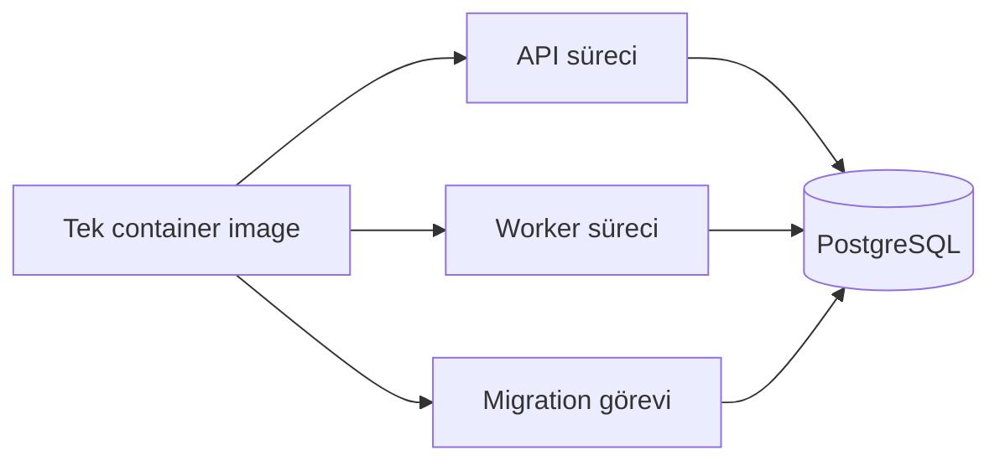

# Dağıtım Notları

Bu doküman, özel backend altyapı temelinde ele alınan dağıtım (deployment) ve çalışma zamanı (runtime) konularını özetler.

Public repository çalıştırılabilir dağıtım şablonları içermez. Bu doküman yalnızca tasarım düşüncelerini açıklar.

## Çalışma Zamanı Yapısı

Özel prototip ayrılmış bir çalışma modeli kullandı:

- HTTP istekleri için API süreci
- denetim/güvenlik iş kuyruğu için worker süreci
- oturumlar, iş kuyruğu kayıtları, denetim kayıtları, güvenlik olayları ve iş verisi için kaynak olarak PostgreSQL
- yeni sürüm öncesinde migration süreci

API ve worker, uygulama süreci seviyesinde durumsuz (stateless) olacak şekilde düşünülmüştür.

Basit ifadeyle: API container yeniden başlarsa oturum, denetim veya iş verisi kaybolmamalıdır; çünkü bunlar süreç belleğinde değil PostgreSQL'de durmalıdır.

## Çalışma Akışı

Aynı değişmez image API, worker ve migration görevleri için farklı komutları destekleyebilir.

## Container ve Çalışma Zamanı Sertleştirme

Özel Docker tasarımı bazı çalışma zamanı uygulamalarını ele aldı:

- çok aşamalı build
- çalışma katmanında production bağımlılıkları
- yapılandırmanın ortam değişkenleri üzerinden sağlanması
- stdout üzerinden loglama
- root olmayan çalışma kullanıcısı
- aynı image üzerinden ayrı API ve worker komutları
- migration dosyalarının runtime image içinde bulunması
- beklenen süreç davranışı için çalışma zamanı kontrolleri
- bağımlılık ve image inceleme kapıları

## Ortam Doğrulama

Özel prototip hassas yapılandırma için hızlı başarısız olan ortam doğrulama içerdi.

Önemli dağıtım kontrolleri:

- production/staging ortamları kimlik bilgili wildcard CORS'a izin vermemeli
- production çerezleri secure olmalı
- trusted proxy hop count gerçek altyapı topolojisiyle eşleşmeli
- API dokümanları production'da varsayılan olarak kapalı olmalı
- dış bildirim teslimi production-like ortamlarda güvenilir kanal kullanmalı
- uygulama anahtarları production'da geliştirme varsayılanlarını kullanmamalı
- request body limitleri açık olmalı

## CI/CD Doğrulama Stratejisi

Özel repository çok katmanlı doğrulama yaklaşımı içerdi:

| Katman | Örnekler |
|---|---|
| Kod sözleşmesi | Typecheck, lint, format, OpenAPI doğrulama, testler, bağımlılık denetimi, build |
| Platform kontrolleri | Docker build, Compose doğrulama, Kubernetes tarzı manifest üretimi, ECS tarzı şablon doğrulama |
| Runtime kontrolleri | Root olmayan çalışma ve beklenen çalışma davranışı |
| Entegrasyon kontrolleri | PostgreSQL servisi, migration, seed data, entegrasyon testleri, kayıt zinciri doğrulama, performans duman testleri |
| Güvenlik incelemesi | Bağımlılık denetimi ve container inceleme kapıları |

## Kodun Tek Başına Çözmediği Üretim Konuları

Backend altyapı temeli iyi varsayılanlar sağlayabilir; ancak gerçek üretim hazırlığı operasyonel kontrollere de bağlıdır.

Gerçek kurumsal dağıtım öncesinde şunlar planlanmalıdır:

- yönetilen veritabanı stratejisi
- yedekleme ve geri yükleme runbook'ları
- migration geri alma stratejisi
- log ve denetim saklama politikası
- izleme panelleri
- iş kuyruğu ve güvenlik olayları için uyarı mekanizmaları
- yapılandırma ve anahtar yenileme süreci
- olay müdahale süreci
- düzenli bağımlılık ve runtime incelemeleri
- gerçekçi yük testi
- veri saklama ve silme iş akışları
- felaket kurtarma denemeleri

## Hosted ve Self-Hosted Bütünlük

Denetim bütünlüğü hikâyesi dağıtım sahipliğine bağlıdır.

Yönetilen SaaS modelinde sağlayıcı veritabanı erişimini, uygulama kodunu, denetim kayıtlarını ve dış logları daha güçlü koruyabilir.

Self-hosted veya müşteri root erişimli modelde altyapı yöneticileri veri, kod veya logları değiştirebilir. Bu modelde denetim bütünlüğü iddiaları, ek kontroller yoksa uygulama seviyesinde kurcalama tespiti olarak ifade edilmelidir.

## Doğru Portfolyo İddiası

Dağıtım çalışması “production zaten çözüldü” şeklinde sunulmamalıdır.

Daha doğru ifade:

> Özel prototip; üretim ortamına hazırlık hedefli çalışma zamanı yapısı, CI kapıları, ortam doğrulama, container sertleştirme ve operasyonel sınırları araştırdı.

Bu ifade sistemi olduğundan büyük göstermeden olgunluk gösterir.

## Portfolyo Çıkarımı

Dağıtım çalışması yalnızca uygulamayı container içinde başlatmak değildir.

Ana ders şudur: üretim hazırlığı; uygulama tasarımı, çalışma zamanı sertleştirme, CI kapıları, ortam doğrulama, operasyonel runbook'lar ve yazılımın kendi başına neyi garanti edip edemeyeceği konusunda dürüst sınırların birleşimidir.
