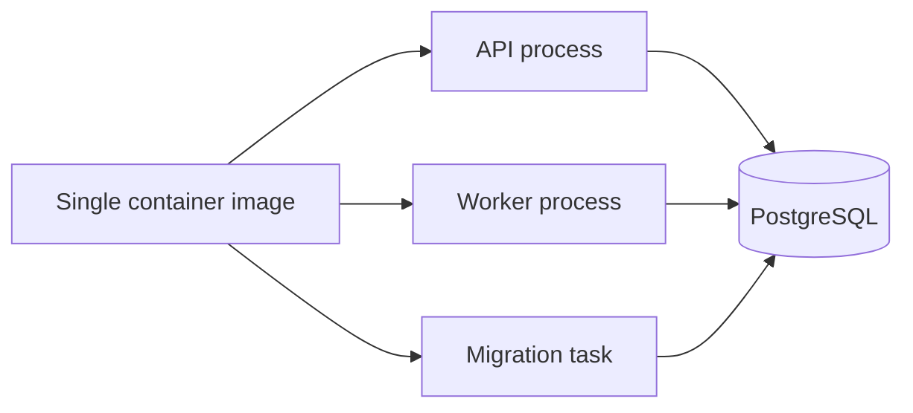

# Deployment Notes

Bu doküman, private enterprise backend foundation içinde ele alınan deployment ve runtime concerns'ü özetler.

Public repository runnable deployment templates içermez. Bu doküman yalnızca design considerations açıklar.

## Runtime Shape

Private prototype split runtime model kullandı:

- HTTP requests için API process
- audit/security outbox dispatch için worker process
- sessions, token state, outbox records, audit logs, security events ve business data için source of truth olarak PostgreSQL
- yeni runtime release öncesinde migration process

API ve worker application-process level'da stateless olacak şekilde düşünülmüştür.

Basit ifadeyle: API container restart olursa session, audit veya business state kaybolmamalıdır; çünkü bunlar process memory'de değil PostgreSQL'de durmalıdır.

## Runtime Flow

Aynı immutable image API, worker ve migration tasks için farklı commands destekleyebilir.

## Container And Runtime Hardening Ideas

Private Docker design bazı runtime practices araştırdı:

- multi-stage build
- runtime layer içinde production dependency install
- configuration'ın environment variables üzerinden sağlanması
- stdout-only logging
- non-root runtime user
- aynı immutable image üzerinden separate API ve worker commands
- committed migrations'ın runtime image içinde available olması
- expected process behavior için runtime checks
- dependency ve image review gates

## Environment Validation

Private prototype sensitive configuration için fail-fast environment validation içerdi.

Önemli deployment checks:

- production/staging environments credentialed wildcard CORS'a izin vermemeli
- production cookies secure olmalı
- trusted proxy hop count gerçek infrastructure topology ile eşleşmeli
- API docs production'da default olarak disabled olmalı; explicit enable edilirse açılmalı
- outbound notification delivery production-like environments içinde trusted channel kullanmalı
- application encryption keys production'da development defaults kullanmamalı
- request body limits explicit olmalı

## CI/CD Validation Strategy

Private repository multi-layer validation approach içerdi:

| Layer | Examples |
|---|---|
| Code contract | Typecheck, lint, formatting, OpenAPI validation, tests, dependency audit, build |
| Platform checks | Docker build, Compose validation, Kubernetes-style manifest rendering, ECS-style template validation |
| Runtime checks | Non-root execution ve expected runtime behavior |
| Integration checks | PostgreSQL service, migrations, seed data, integration tests, hash-chain verification, performance smoke checks |
| Security review | Dependency audit ve container review gates |

## Production Considerations Not Fully Solved By Code

Backend foundation iyi defaults sağlayabilir; ancak gerçek production readiness operational controls'e de bağlıdır.

Gerçek enterprise deployment öncesinde şunlar planlanmalıdır:

- managed database strategy
- backup and restore runbooks
- migration rollback strategy
- log and audit retention policy
- monitoring dashboards
- outbox dead-letter growth ve security events için alerting
- configuration ve key rotation process
- incident response procedure
- periodic dependency ve runtime reviews
- realistic load testing
- data retention ve deletion workflows
- disaster recovery exercises

## Hosted vs Self-Hosted Integrity

Audit integrity story deployment ownership'e bağlıdır.

Managed SaaS modelinde provider database access, application code, audit trails ve external logs'u daha güçlü koruyabilir.

Self-hosted veya customer-root-access modelinde infrastructure administrators data, code veya logs'u değiştirebilir. Bu modelde audit integrity claims, external anchoring/protected backups/third-party log export eklenmedikçe application-level tamper evidence olarak ifade edilmelidir.

## Correct Portfolio Claim

Deployment work “production already solved” şeklinde sunulmamalıdır.

Daha doğru claim:

> Private prototype production-oriented runtime structure, CI gates, environment validation, container hardening ve operational boundaries konularını araştırdı.

Bu ifade sistemi olduğundan büyük göstermeden maturity gösterir.

## Portfolio Takeaway

Deployment work sadece application'ı container içinde başlatmak değildir.

Ana ders şudur: production readiness; application design, runtime hardening, CI gates, environment validation, operational runbooks ve software'in kendi başına neyi garanti edip edemeyeceği konusunda dürüst sınırların birleşimidir.
