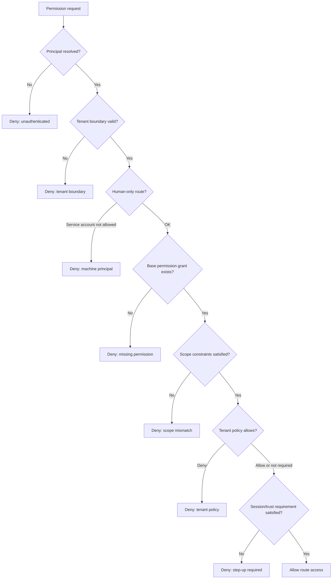

# Permission Engine Decision Flow

Bu doküman, private backend foundation içindeki permission engine'in kavramsal karar akışını açıklar.

Permission engine, authorization modelinin kalbidir. Kimlik, tenant boundary, route permission, scoped grants, relationship checks, tenant policies, session trust ve resource facts tek final karara burada dönüşür.

Bu public doküman private source code paylaşmaz. Karar modelini architecture seviyesinde anlatır.

## Permission Engine Neden Önemli?

Çok kiracılı bir business backend'de authorization sadece “kullanıcının rolü var mı?” sorusu değildir.

Güvenli bir karar için sistem şunları bilmek zorunda kalabilir:

- authenticated principal kim?
- principal human user mı, service account mu?
- request hangi tenant context içinde?
- route hangi permission'ı istiyor?
- erişilen resource nedir?
- resource hangi branch, department, team veya custom dimension'a ait?
- principal doğru role grant'e sahip mi?
- tenant policy bu action'ı deny veya allow ediyor mu?
- principal ile resource arasında ilişki var mı?
- session sensitive action için yeterli trust seviyesinde mi?
- route allow edilse bile response restricted field'ları göstermeli mi?

Her controller bu soruları kendi içinde cevaplamaya çalışırsa sistem tutarsız hale gelir. Permission engine, bu kararları merkezi ve öngörülebilir yapmak için vardır.

## Karar Girdileri

Bir permission decision kavramsal olarak şu girdileri alır:

| Girdi | Amaç |
|---|---|
| Principal | Authenticated user, service account veya system actor. |
| Tenant context | Request'in tenant boundary'si. |
| Permission key | Route'un istediği named permission. |
| Resource type | Erişilen object türü. |
| Action | Denenen işlem: read, create, update, transition, manage gibi. |
| Resource ID | Object-level access gerekiyorsa exact object ID. |
| Resource owner | Ownership veya manager-style access gerekiyorsa server-derived owner user ID. |
| Resource dimensions | Server-derived branch, department, team, region, location veya custom dimensions. |
| Resource attributes | Classification veya başka trusted attributes. |
| Access scope | Principal'ın roles, permissions, scope constraints, relationships, policies ve trust facts bilgileri. |

En önemli kural: authorization için kullanılan hassas access facts, request body claim'lerinden değil trusted server-side data'dan gelmelidir.

## High-Level Decision Flow



## Adım Adım Açıklama

### 1. Principal resolution

Engine, authentication aşamasının protected route için bir principal resolve ettiğini varsayar.

Principal şu tiplerden biri olabilir:

- human user
- service account
- system/internal actor

Protected route için principal yoksa business logic çalışmadan deny edilir.

### 2. Tenant boundary check

Tenant boundary, business permission detaylarından önce değerlendirilir.

Bu, bir role veya relationship grant'in başka tenant'a ait object üzerinde yanlışlıkla kullanılmasını engeller.

Basit kural:

> Sistem target object'in izin verilen tenant context içinde olduğunu kanıtlamadan permission anlamlı değildir.

### 3. Principal-type guard

Bazı operations human actor gerektirir.

Örneğin bir service account, broad technical permission'a sahip olsa bile human-only workflow çalıştırmamalıdır.

Bu, machine credential ile gerçek user intent'in karışmasını engeller.

### 4. Base permission grant

Engine, principal'ın route'un istediği named permission'a sahip olup olmadığını kontrol eder.

Bu kararın RBAC-style kısmıdır.

Örnek permission konseptleri:

```text
users.read
sales.orders.create
audit-logs.read
service-accounts.manage
```

Base grant gereklidir ama her zaman tek başına yeterli değildir.

### 5. Scope constraints

Bir permission scope ile sınırlandırılmış olabilir.

Örnekler:

- sadece kendi kayıtları
- sadece aynı branch
- sadece aynı department
- sadece aynı team
- required resource relationship
- required owner relationship
- required resource classification
- required custom tenant dimension

Scope bir resource fact gerektiriyorsa route bu fact'i trusted server-side data'dan sağlamalıdır.

Fact eksikse güvenli sonuç deny'dır.

### 6. Relationship checks

ReBAC-style checks, access bir ilişkiye bağlı olduğunda kullanılır.

Güvenli relationship check exact olmalıdır:

```text
tenant + subject + relation + resource type + resource id
```

“Manager” gibi genel bir ilişki etiketi tek başına yeterli değildir. Karar hangi resource'a erişildiğini bilmelidir.

### 7. Tenant policy checks

PBAC-style kurallar tenant-level policy kararları sağlar.

Beklenen davranış:

- matching deny policies önce kazanır
- resource/action için allow policies varsa en az bir matching allow geçmelidir
- policy yoksa engine normal grant ve scope sonucuyla devam eder

Bu yapı tenant governance'ın her module'ü yeniden yazmadan daha katı lokal kurallar eklemesini sağlar.

### 8. Session veya trust requirement

Bazı sensitive action'lar daha güçlü session state gerektirebilir.

Örneğin route, high-impact operation için yakın zamanda yapılmış step-up verification isteyebilir.

Permission engine, insufficient trust durumunu controller'ın lokal tahminine bırakmak yerine açık bir deny reason olarak ele alabilir.

### 9. Final route decision

Final decision açık olmalıdır:

```text
allow
```

veya

```text
deny with reason
```

Reasoned denial; testing, logging, audit review ve debugging için önemlidir.

## Field Projection Route Access'ten Sonra Gelir

Permission engine route action'ın allow edilip edilmeyeceğine karar verir.

Field projection ayrı bir adımdır.

Bir user kayıtları listeleyebilir ama restricted field'ları görme hakkına sahip olmayabilir. Bu yüzden response minimization ayrı olarak [Data Classification](./data-classification.md) dokümanında anlatılır.

## Bu Tasarım Hangi Hataları Engellemeye Çalışır?

| Failure mode | Daha güvenli davranış |
|---|---|
| Controller kendi custom permission check'ini yapar | Route centralized permission middleware ve engine kullanır. |
| Route owner veya branch bilgisini request body'den alır | Route fact'leri server/database üzerinden resolve eder. |
| Eksik branch/team/owner fact görmezden gelinir | Decision fail closed olur. |
| Service account human user gibi davranır | Human-only route'lar machine principal'ı reddeder. |
| Tenant policy business write'tan sonra kontrol edilir | Policy operation başlamadan önce karara katılır. |
| Broad route access sensitive field'ları açar | Field projection restricted response field'ları ayrı kontrol eder. |

## Portfolio Takeaway

Permission engine önemlidir çünkü birçok küçük güvenlik sorusunu tek, tekrar edilebilir karar sürecine dönüştürür.

Profesyonel mesaj sadece “role ekledim” değildir.

Daha güçlü mesaj şudur:

> Authorization modelini tenant boundaries, server-derived facts, scoped grants, relationship checks, policy rules, trust requirements, explicit denial reasons ve ayrı response projection etrafında tasarladım.
